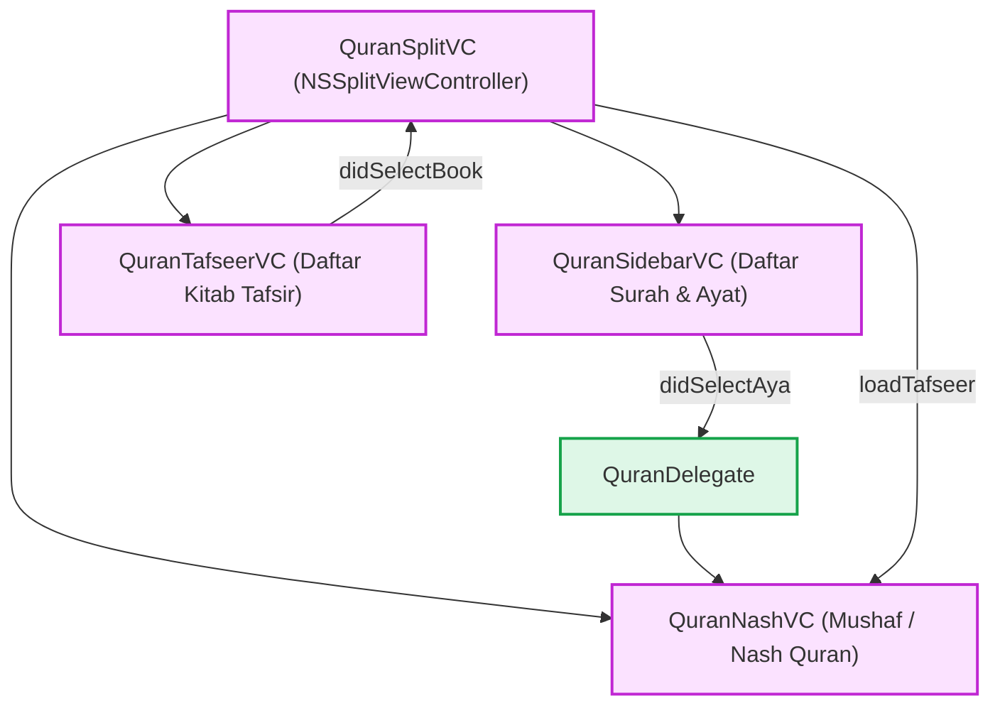

# Quran & Tafsir

Fitur **Quran** menyediakan kemampuan membaca mushaf Al-Qur'an beserta kitab-kitab tafsirnya. Fitur ini memanfaatkan `QuranDataManager` untuk memuat data Al-Qur'an (Surah dan Ayat) dari basis data khusus serta mencocokkannya dengan kitab-kitab tafsir yang tersedia di perpustakaan Maktabah.

## Alur Arsitektur (*Architecture Pipeline*)

## Sub-Komponen Dokumentasi

- **[Database Layer](database.md)**: Pengelolaan `special.sqlite` (tabel `Qr` dan `Sora`) serta integrasi kitab tafsir.
- **[Data Models](models.md)**: Struktur data ayat (`Quran`) dan surah (`SurahNode`).
- **[State Management](viewmodel.md)**: Koordinasi *state* berbasis *Data Manager* dan *delegation*.
- **[macOS Implementation](macos.md)**: Implementasi AppKit dengan *three-pane* `NSSplitView`.
- **[iOS Implementation](ios.md)**: Status implementasi pada platform iOS.
- **[Protocols & Contracts](protocols.md)**: Kontrak `QuranDelegate` untuk sinkronisasi antarmuka.
