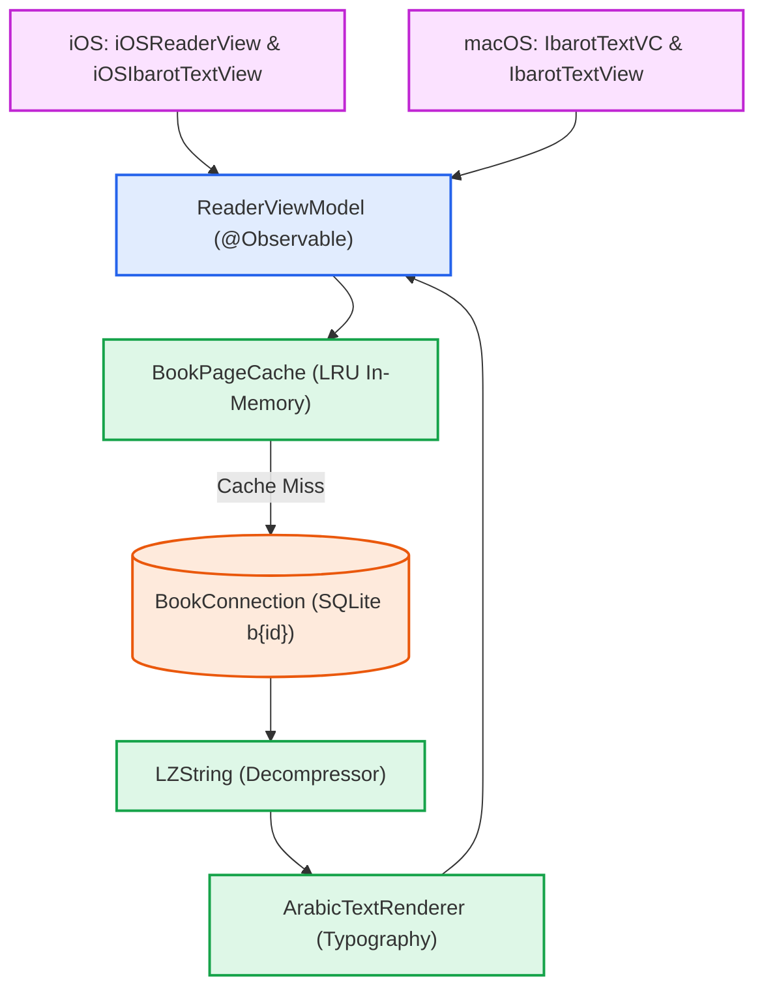

## Gambaran Umum (Overview)

Fitur *Reader Engine* merupakan modul inti (*core*) aplikasi Maktabah yang bertugas menangani *rendering* teks Arab berskala besar, proses *pagination*, dan *continuous scroll* secara efisien. Komponen ini disusun dalam arsitektur MVVM (*Model-View-ViewModel*) yang modular untuk mendukung implementasi lintas platform (macOS dan iOS).

## Struktur Modul

Modul ini dibagi menjadi beberapa subkomponen utama yang didokumentasikan secara terpisah:

- [Cache](cache.md): Mekanisme *caching in-memory* berbasis *LRU cache*.
- [Data Models](models.md): Model konten kitab, tipografi hasil pemrosesan, daftar isi (TOC), dan *state reader*.
- [iOS Implementation](ios.md): Implementasi antarmuka pengguna khusus iOS.
- [macOS Implementation](macos.md): Implementasi antarmuka pengguna khusus macOS.
- [Protocols](protocols.md): Abstraksi antarmuka (*protocols/interfaces*).
- [Selection & Context Menu](menu.md): Pencegatan pembuatan anotasi duplikat dan aksi menu seleksi teks.
- [TextView (macOS & iOS)](textview.md): Implementasi kustom *text view rendering engine*.
- [ViewModel](viewmodel.md): Pengontrol logika bisnis dan alur reaktivitas utama.

## Prasyarat & Dependensi (Prerequisites)

> Modul ini bergantung pada `SQLiteDatabase` untuk akses data dan utilitas kompresi `LZString`.

- **Platform**: macOS 15+ (AppKit), iOS 16+ (SwiftUI + UIKit).
- **Dependensi Internal**: `TextViewState` (pengelolaan preferensi visual font dan harakat), `ArabicRangeCalculator` (sinkronisasi pemetaan rentang teks sumber dan teks tampilan).
