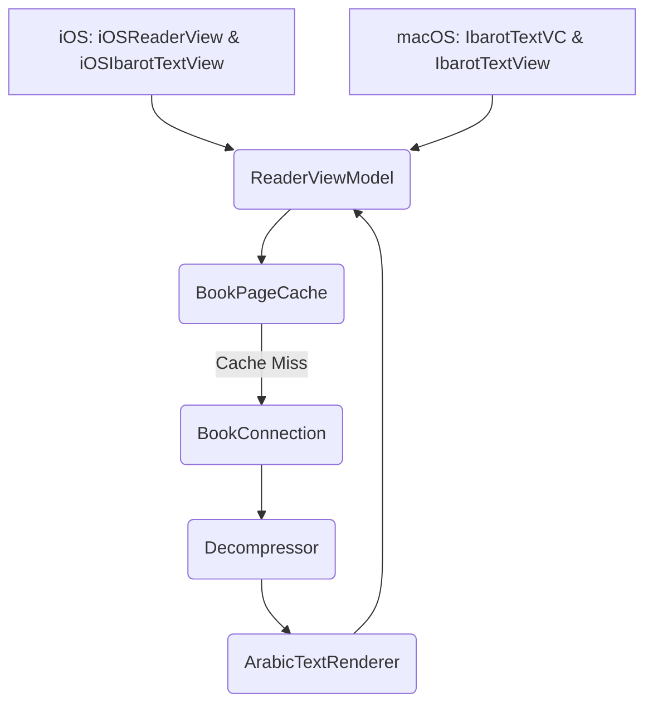

## Gambaran Umum (Overview)

Fitur Reader Engine merupakan inti (core) dari aplikasi Maktabah yang bertugas menangani rendering teks Arab dalam skala besar, proses pagination, dan continuous scroll secara efisien. Komponen ini disusun dalam arsitektur MVVM (Model-View-ViewModel) yang modular untuk mendukung implementasi lintas platform (macOS dan iOS).

## Struktur Modul

Modul ini dipecah ke dalam beberapa komponen utama yang didokumentasikan secara terpisah:

- [Cache](cache.md): Mekanisme caching berbasis LRU.
- [Data Models](models.md): Model konten kitab, tipografi terproses, TOC, dan state reader.
- [iOS Implementation](ios.md): Implementasi UI spesifik iOS.
- [macOS Implementation](macos.md): Implementasi UI spesifik macOS.
- [Protocols](protocols.md): Abstraksi antarmuka (interfaces).
- [TextView (macOS & iOS)](textview.md): Implementasi text view rendering kustom.
- [ViewModel](viewmodel.md): Pengontrol logika bisnis utama.

## Prasyarat & Dependensi (Prerequisites)

> Komponen ini bergantung pada `SQLiteDatabase` untuk akses data dan utilitas kompresi `LZString`.

- **Platform**: macOS 15+ (AppKit), iOS 16+ (SwiftUI + UIKit).
- **Dependensi Internal**: `TextViewState` (manajemen preferensi visual font/harakat), `ArabicRangeCalculator` (sinkronisasi rentang teks asli dan tampilan).
