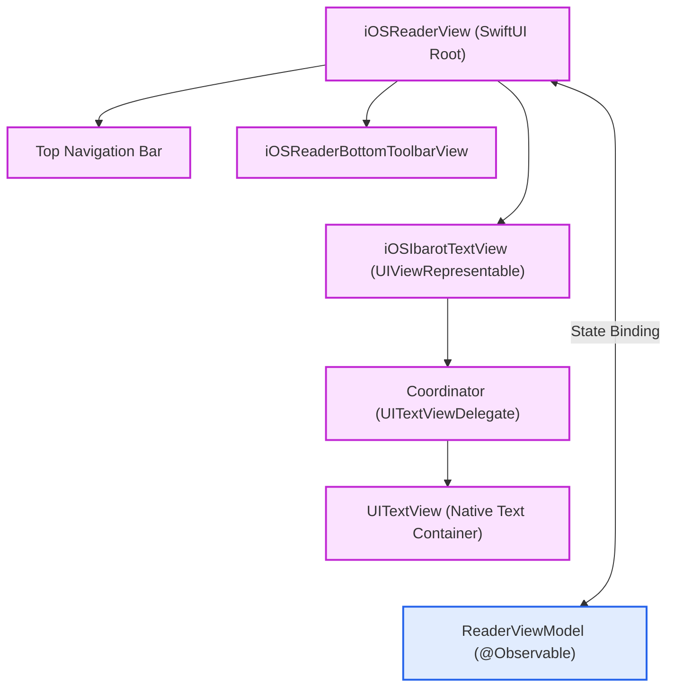
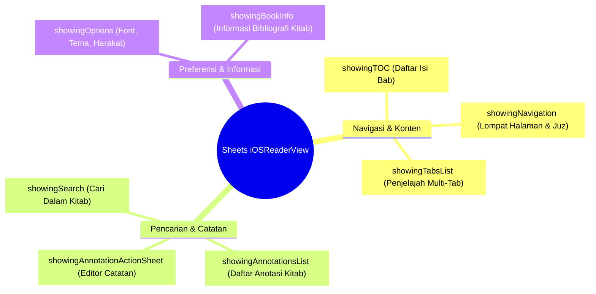
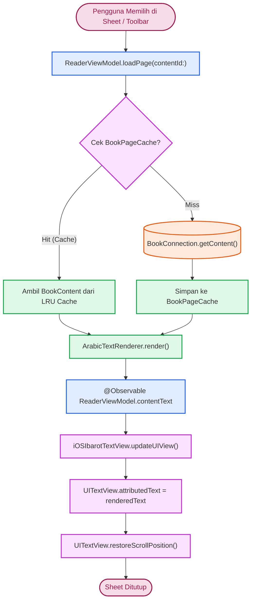

# Reader iOS Implementation (SwiftUI & UIKit)

Implementasi antarmuka layar pembaca pada platform iOS menggunakan integrasi antara arsitektur deklaratif **SwiftUI** (sebagai pengelola kontainer, *toolbar*, dan lembar modal) dan **UIKit** (`UITextView` melalui `UIViewRepresentable`) demi stabilitas tipografi teks Arab berharakat serta performa *rendering* yang tinggi.

Sumber kode: `Source/Features/Reader/iOS/`

---

## 1. Arsitektur Komponen Visual

Arsitektur antarmuka pembaca iOS mengombinasikan orkestrasi modal deklaratif SwiftUI dengan *rendering engine* UIKit:

### A. Hierarki Kontainer Pembaca

### B. Taksonomi Lembaran Modal (*Toolbar Sheets*)

---

## 2. Alur Interaksi: Dari Aksi Klik Toolbar / Sheet ke TextView

Ketika pengguna memilih bab dari Daftar Isi (TOC), melompat ke halaman tertentu, atau mengetuk hasil pencarian dalam kitab:

---

## 3. Bedah Komponen & Logika Antarmuka

### A. Ekosistem Lembaran Toolbar (*Toolbar Sheets Manager*)
`iOSReaderView` mengontrol visibilitas tampilan modal melalui variabel `@State` boolean terdedikasi:

| Variabel State | Komponen Sheet | Fungsi Utama |
| :--- | :--- | :--- |
| `showingTOC` | `TOCView` | Menampilkan struktur hierarki bab (*outline*) kitab. |
| `showingOptions` | `iOSReaderAppearanceSheet` | Mengonfigurasi ukuran font Arab, famili font, visibilitas harakat, dan tema latar belakang (Sepia, Dark, Black, White). |
| `showingSearch` | `SearchInBookSheet` | Pencarian teks cepat khusus di dalam halaman-halaman kitab aktif. |
| `showingAnnotationsList` | `AnnotationListView` | Menampilkan seluruh penanda dan catatan teks yang tersimpan untuk kitab ini. |
| `showingBookInfo` | `BookInfoSheet` | Kartu informasi bibliografi, penerbit, nomor cetakan, dan tahun wafat pengarang. |
| `showingAnnotationActionSheet` | `iOSAnnotationEditorSheet` | Panel modal penyuntingan isi catatan (*note*), pergantian warna sorotan, atau penghapusan anotasi. |
| `showingNavigation` | `PageJumpSheet` | Bilah geser (*slider*) cepat dan kolom masukan nomor halaman/juz. |
| `showingTabsList` | `TabsSheet` | Menampilkan daftar kitab yang sedang dibuka secara bersamaan (*multi-tab reader*). |

### B. Jembatan `iOSIbarotTextView` (`UIViewRepresentable`)
Mengintegrasikan `UITextView` UIKit ke dalam arsitektur deklaratif SwiftUI:

* **`makeUIView`**: Menginisialisasi `UITextView` kustom dengan properti *non-editable*, *selectable*, serta mendukung perpindahan per halaman (*paging mode*) maupun pengguliran kontinu (*continuous scrolling*).
* **`updateUIView`**: Menerima injeksi `NSAttributedString` baru dari `ReaderViewModel`. Pada metode ini, lapisan warna anotasi dan sorotan kata kunci pencarian diterapkan secara dinamis berdasarkan kalkulasi rentang teks.
* **`Coordinator` (`UITextViewDelegate`)**: Menangani interaksi seleksi teks untuk memunculkan menu pembuatan *highlight/underline* baru serta mencegat ketukan pada rentang anotasi yang telah ada (`onTapAnnotation`).

### C. Penanganan Ekstensi UI & Mode Membaca Layar Penuh (*Fullscreen*)

* **Toggle Fullscreen Mode**: Pengguna dapat mengetuk bagian tengah teks untuk menyembunyikan bilah navigasi atas dan *toolbar* bawah (`isReading.toggle()`), memberikan ruang baca penuh yang imersif.
* **Geometri Layar & Rotasi**: Saat *toolbar* disembunyikan atau orientasi perangkat diputar (*Portrait* $\leftrightarrow$ *Landscape*), tata letak UIKit menyesuaikan *safe area insets* dan melakukan pemulihan posisi gulir (*scroll position restoration*) agar paragraf yang sedang dibaca tidak bergeser.
