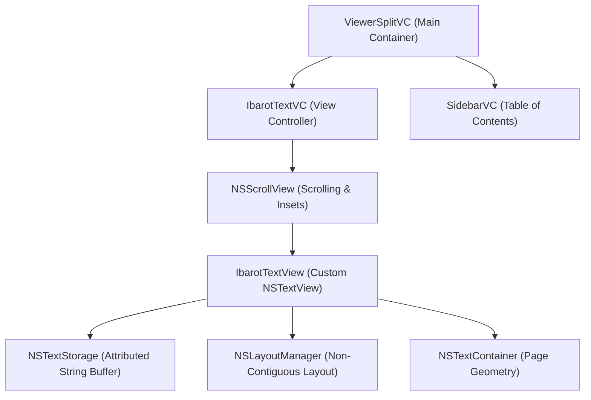
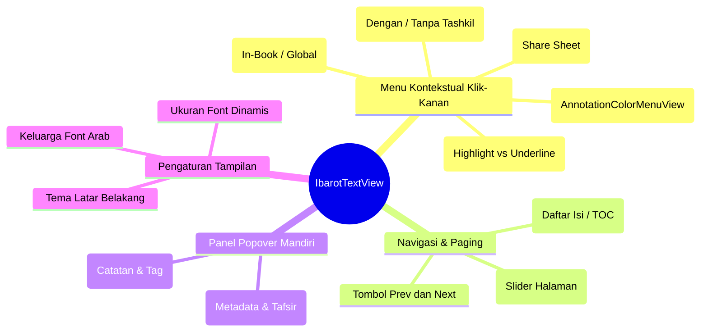
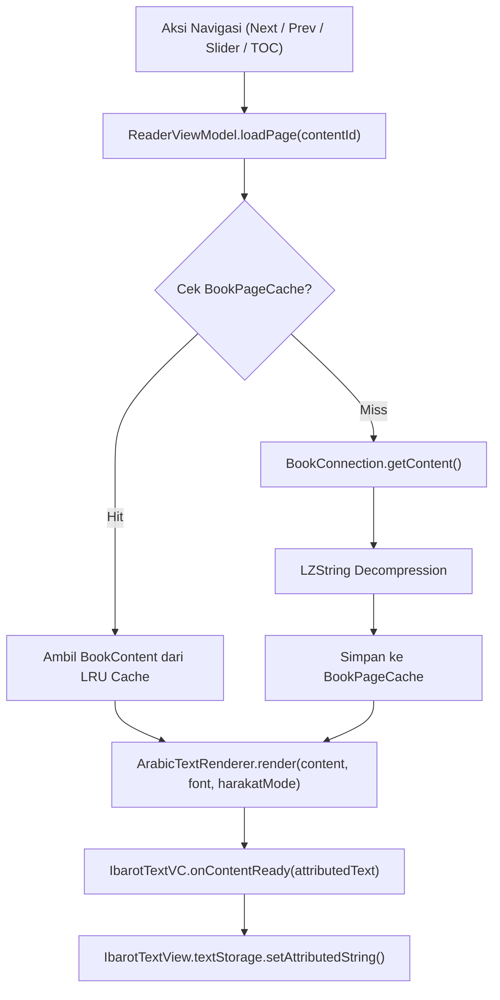
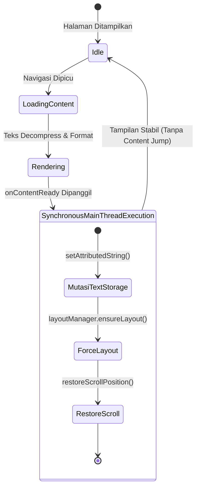
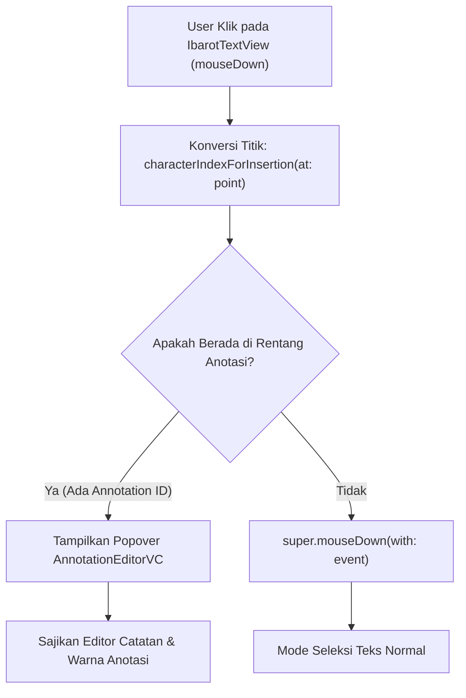

# Reader macOS Implementation (AppKit)

Implementasi layar pembaca Maktabah pada macOS dibangun secara *native* menggunakan hierarki murni AppKit tanpa lapisan SwiftUI. Hal ini bertujuan untuk mencapai performa optimal saat me-*render* puluhan ribu baris teks Arab berharakat secara instan tanpa hambatan visual.

Sumber kode:

* Controller: `Source/Features/Reader/macOS/IbarotTextVC.swift`
* Custom TextView: `Source/UI/macOS/TextView/IbarotTextView.swift`

---

## 1. Arsitektur Komponen Visual (UI Hierarchy)

Hierarki tampilan pembaca AppKit dirancang terpisah antara pembungkus kontainer gulir (`NSScrollView`), kanvas perenderan teks kustom (`IbarotTextView`), serta subsistem tipografi teks bawaan macOS:



---

## 2. Peta Kontrol, Menu & Popover Interaktif

Seluruh fitur interaktif yang terhubung pada `IbarotTextView` dikelompokkan ke dalam beberapa kategori kontrol:



---

## 3. Pipeline Pemuatan Halaman: Dari Aksi Navigasi ke TextView

Alur linier pemrosesan data ketika pengguna berpindah halaman hingga teks tampil di layar:



---

## 4. Siklus Hidup Sinkron & Restorasi Layout

Diagram status (*State Diagram*) berikut memperlihatkan perlunya eksekusi sinkron pada *Main Thread* untuk mencegah pergeseran posisi gulir (*content jumping*):



---

## 5. Bedah Komponen & Logika Antarmuka

### A. Orkestrasi Sinkron dengan `IbarotTextVC`
`IbarotTextVC` mengontrol alur presentasi tanpa bergantung pada observer asinkron:

```swift
func bindViewModel() {
    viewModel.onContentReady = { [weak self] attributedText in
        guard let self = self else { return }
        self.textView.textStorage?.setAttributedString(attributedText)
        self.textView.layoutManager?.ensureLayout(for: self.textView.textContainer!)
        self.restoreScrollPosition()
    }
}
```

* **Mencegah Content Jumping**: Karena `textStorage` diperbarui secara sinkron pada siklus *RunLoop* yang sama, posisi gulir `NSScrollView` tidak terdistorsi saat berganti halaman.

### B. `IbarotTextView` (Class) - Subkelas `NSTextView`
Mengoptimalkan *rendering* teks Arab berukuran besar:

| Fitur / Modifikasi | Tujuan Teknis |
| :--- | :--- |
| `allowsNonContiguousLayout = true` | **Optimasi Memori**: Hanya menghitung glif dan baris yang berada dalam area *viewport* aktif. |
| `baseWritingDirection = .rightToLeft` | Memastikan pergerakan kursor dan seleksi teks berjalan alami dari kanan ke kiri (RTL). |

### C. Pencegatan Event Klik & Anotasi (`mouseDown`)
`IbarotTextView` menangkap *event* klik untuk memeriksa apakah pengguna mengetuk anotasi yang sudah ada (apabila pengaturan `UserDefaults.enableAnnotationClick` aktif):



```swift
override func mouseDown(with event: NSEvent) {
    let point = self.convert(event.locationInWindow, from: nil)
    let charIndex = self.characterIndexForInsertion(at: point)

    if let annotationId = findAnnotation(at: charIndex) {
        showAnnotationEditor(id: annotationId, at: point)
    } else {
        super.mouseDown(with: event)
    }
}
```

### D. Menu Kontekstual Lengkap (`menu(for event:)`)
Ketika pengguna mengklik kanan pada teks atau melakukan seleksi:

* **Palet Warna Cepat (`AnnotationColorMenuView`)**: Menyajikan bulatan warna sorotan langsung di menu klik kanan tanpa harus membuka modal editor.
* **Toggle Underline & Highlight**: Mengubah gaya penandaan antara garis bawah atau latar warna.
* **Opsi Salin Teks**:
  * *Copy with Tashkil*: Menyalin teks lengkap beserta harakat.
  * *Copy without Tashkil*: Menghapus tanda harakat secara instan melalui `ArabicTextRenderer.stripHarakat()` sebelum dimasukkan ke *clipboard*.
* **Pencarian Kontekstual**: Opsi mencari frasa yang diseleksi di dalam kitab aktif (*In-Book Search*) atau di seluruh katalog perpustakaan (*Global FTS*).
* **Menu Penampilan Teks**: Menyesuaikan ukuran font, famili font Arab (*Traditional Arabic*, *Scheherazade*, *Amiri*), dan tema latar belakang (*Sepia*, *Dark Sepia*, *White*, *Black*).
