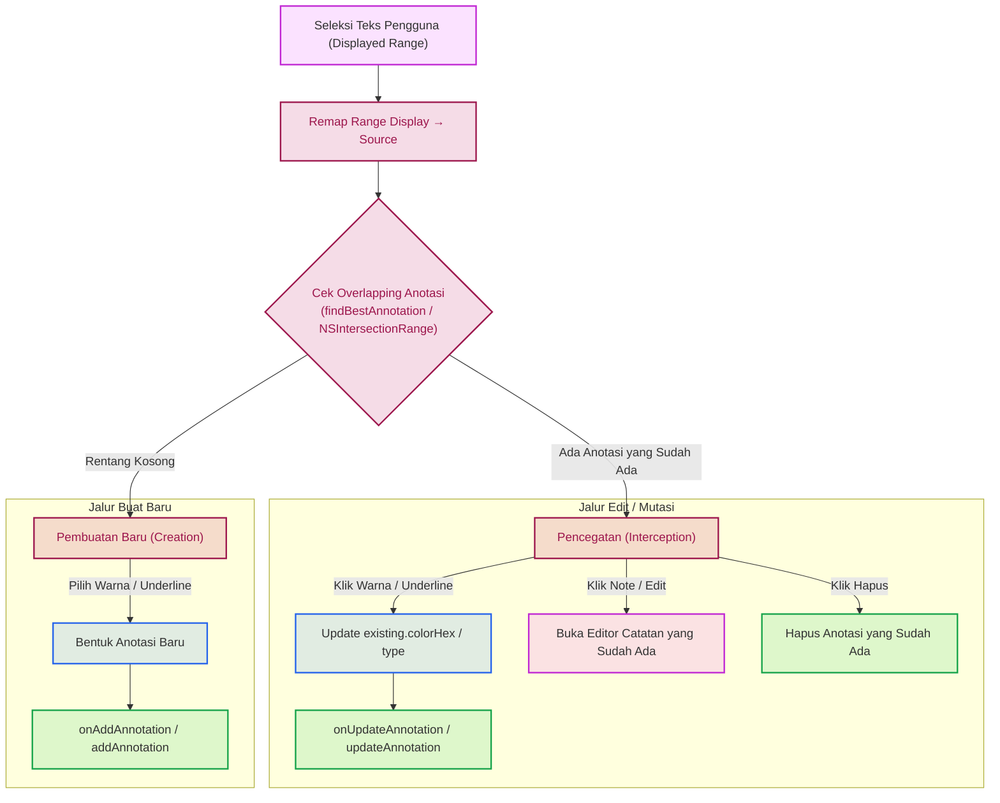

# Selection & Context Menu

Menu seleksi teks dan klik kanan (*context menu*) pada Reader mengimplementasikan mekanisme **pencegatan pembuatan anotasi (*annotation creation interception*)**. Logika ini menjamin bahwa pemilihan warna atau gaya garis bawah (*underline*) pada teks yang telah memiliki anotasi tidak akan membuat entri duplikat baru, melainkan mencegat aksi tersebut untuk memperbarui (*mutate/update*) anotasi yang sudah ada.

Mekanisme pencegatan ini memiliki paritas logika yang identik di macOS (`IbarotTextView`) dan iOS (`iOSIbarotTextView`).

---

## 1. Alur Arsitektur Pencegatan (*Interception Pipeline*)

Berikut adalah diagram alur keputusan saat pengguna melakukan seleksi teks dan berinteraksi dengan menu:



---

## 2. Implementasi macOS (IbarotTextView)

Pada macOS, interaksi menu terjadi melalui `override func menu(for event: NSEvent) -> NSMenu?` dan selektor aksi tombol warna.

### Penyusunan Menu Kontekstual
Ketika pengguna memilih teks dan membuka *context menu*:

1. **Filtering Item Sistem**: `filterMenuItems` menghapus item bawaan macOS yang tidak relevan (*Cut*, *Paste*, *Speech*, *Spelling*, *Substitutions*).
2. **Palette Horizontal**: `buildHighlightGroup()` menyematkan bilah palet horizontal kustom (`AnnotationColorMenuView`) yang memuat pilihan warna terakhir dan tombol *underline*.
3. **Menu Kondisional**:
   - Jika seleksi bertumpukan dengan anotasi lama: Menampilkan menu **"Edit Note"** dan **"Delete Highlight"** / **"Delete Highlight & Note"**.
   - Menambahkan opsi **"Share with Reference"** untuk membagikan teks beserta rujukan kitab.

### Pencegatan Aksi Warna & Underline (applyAnnotations)
Saat tombol warna atau tombol *underline* ditekan di menu:

```swift
private func applyAnnotations(
    in selectedRange: NSRange,
    with color: NSColor,
    mode: AnnotationMode
) throws {
    defer {
        if selectedRange.length > 0 {
            setSelectedRange(NSRange(location: selectedRange.location, length: 0))
        }
        colorMenuView.reloadColors()
    }

    guard selectedRange.length > 0 else { return }

    let sourceSelection = sourceRange(forDisplayedRange: selectedRange)

    let overlapping = annotations.first {
        let r = state.showHarakat ? $0.rangeDiacritics : $0.range
        return NSIntersectionRange(r, sourceSelection).length > 0
    }

    if var existing = overlapping {
        // PENCEGATAN: Edit anotasi yang sudah ada, bukan membuat baru
        existing.colorHex = color.hexString()
        existing.type = mode
        onUpdateAnnotation?(existing)
    } else {
        // BUAT BARU: Belum ada anotasi pada rentang ini
        onAddAnnotation?(sourceSelection, color, mode, sourceTextForAnnotations())
    }
}
```

### Pencegatan Editor Catatan (annotateSelection)
Hal serupa diterapkan ketika pengguna memicu dialog catatan:
```swift
let overlapping = annotations.first {
    let r = state.showHarakat ? $0.rangeDiacritics : $0.range
    return NSIntersectionRange(r, selection).length > 0
}

if let existing = overlapping {
    presentAnnotationEditor(existing, displayedRange: displayedSelection)
    return
}
```
Jika rentang seleksi bersinggungan dengan anotasi lama, modal editor dibuka untuk menyunting anotasi yang sudah ada alih-alih membuat catatan baru.

---

## 3. Implementasi iOS (iOSIbarotTextView)

Pada iOS, menu seleksi teks menggunakan API `UIEditMenuInteraction` melalui delegasi `UITextViewDelegate`.

### Pembentukan Menu Adaptif
Saat pengguna memilih teks, sistem memanggil delegasi `textView(_:editMenuForTextIn:suggestedActions:)`:

```swift
func textView(
    _ textView: UITextView,
    editMenuForTextIn range: NSRange,
    suggestedActions: [UIMenuElement]
) -> UIMenu? {
    guard range.length > 0 else { return nil }

    let sourceRange = currentRenderResult?.remapSourceRange(range) ?? range
    let sourceText = currentRenderResult?.sourceText ?? textView.text ?? ""

    let menuChildren: [UIMenuElement] = if let existing = parent.viewModel.findBestAnnotation(for: sourceRange) {
        buildExistingAnnotationMenuChildren(for: existing)
    } else {
        buildNewAnnotationMenuChildren(sourceRange: sourceRange, sourceText: sourceText)
    }

    var actions = suggestedActions
    // ... penyisipan opsi Share with Reference ...
    let customMenu = UIMenu(
        title: String(localized: .annotation),
        image: UIImage(systemName: "highlighter"),
        children: menuChildren
    )
    actions.insert(customMenu, at: 1)
    return UIMenu(children: actions)
}
```

### Deteksi Overlap Terbaik (findBestAnnotation)
Pencarian anotasi yang sudah ada dijalankan oleh `AnnotationCoordinator.findBestAnnotation`:

1. **Fully Contain**: Mencari anotasi yang mencakup seluruh rentang seleksi (`range.contains(selectionRange)`). Jika terdapat lebih dari satu, dipilih anotasi dengan rentang terpendek (*paling spesifik*).
2. **Largest Overlap**: Jika tidak ada yang melingkupi secara penuh, diambil anotasi yang memiliki persinggungan rentang terbesar (`findLargestOverlap`).

### Diferensiasi Aksi Menu iOS
- **Kasus Anotasi yang Sudah Ada**:
  Menu menyajikan tombol **"Edit Note"** (membuka lembar sunting anotasi via `onTapAnnotation`) dan **"Delete Highlight"** (menghapus anotasi via `viewModel.deleteAnnotation`).
- **Kasus Belum Ada Anotasi**:
  Menu menampilkan sub-menu palet warna sorotan (*highlight*) dan tombol **"Underline"** yang memicu `onAddAnnotation`.

---

## 4. Perbandingan Logika macOS vs iOS

| Fitur / Tahapan | macOS (`IbarotTextView`) | iOS (`iOSIbarotTextView`) |
| :--- | :--- | :--- |
| **Pemicu Menu** | Klik kanan *mouse / trackpad* (`NSMenu`) | Seleksi teks / popover (`UIEditMenuInteraction`) |
| **Pencegatan Warna** | Dicegat di `applyAnnotations` via `NSIntersectionRange` | Menu warna dialihkan ke aksi sunting jika `findBestAnnotation` menemukan entri |
| **Pencegatan Underline** | Mengubah `existing.type = .underline` pada entri lama | Menyajikan aksi *underline* baru hanya jika rentang belum bertumpukan |
| **Penghapusan** | `buildDeleteItem` memanggil `deleteAnnotationMenuItem` | `buildExistingAnnotationMenuChildren` memanggil `deleteAction` destruktif |
| **Normalisasi Harakat** | Menyesuaikan `rangeDiacritics` vs `range` via `TextViewState.shared.showHarakat` | Menyesuaikan `rangeDiacritics` vs `range` via `AnnotationCoordinator` |
