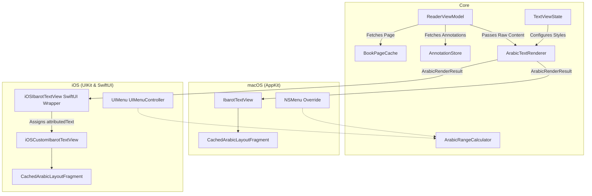

# TextView Core (macOS & iOS)

Dokumentasi teknis mendalam untuk implementasi TextView khusus (*custom TextView*) pada Maktabah (macOS & iOS), yang bertugas untuk merender teks Arab kompleks, menangani tasykil (harakat), mengelola sinkronisasi anotasi, dan mengkoordinasikan rendering dengan antrean tugas mandiri.

---

## Architecture Pipeline

Alur perenderan pada `TextView` melibatkan ViewModel, cache halaman, pemroses teks (Core Engine), penyimpanan lokal, dan pembungkus spesifik platform (AppKit / UIKit).



---

## Penggunaan SerialTask (SerialTaskQueue) di dalam TextView

Pengelolaan konkurensi di `IbarotTextView` (khusus macOS) dikelola menggunakan `SerialTaskQueue`. Kelas ini sangat penting untuk memastikan tugas-tugas berat di *thread* belakang dieksekusi secara sinkron dan berurutan, guna menghindari kondisi pacu (race conditions) saat UI mencoba merender atau melompat ke lokasi teks.

Contoh penggunaan:

1. **Pemuatan Teks (`loadIbarotText`)**:
    Menyusun dan menerapkan teks Arab panjang memerlukan pemrosesan fonetis dan ligatur. Ketika pengguna berpindah halaman dengan cepat, *task* sebelumnya dapat dibatalkan (`taskQueue.cancelAll()`) dan digantikan oleh perenderan halaman baru yang berjalan di antrean terpisah sebelum dikembalikan ke MainActor.
2. **Pencarian & Anotasi (`highlightAndScrollToAnns`, `highlightAndScrollToText`)**:
    Operasi ini menunggu *layouting* dokumen selesai. Membungkus fungsi perenderan ke antrean serial menjamin bahwa *layoutManager* sudah tuntas menghitung metrik sebelum `scrollRangeToVisible(_:)` dipanggil.

---

## Penjelasan Detail Mengenai CachedArabicLayoutFragment

`CachedArabicLayoutFragment` adalah turunan spesifik dari `NSTextLayoutFragment` pada framework TextKit 2, yang difungsikan baik di platform AppKit (`IbarotTextView`) maupun UIKit (`iOSCustomIbarotTextView`).

Alur Kerja Utama:

- Mengambil alih proses `draw(at:in:)` dengan membuat *offscreen* `CGLayer` sebagai memori penyangga (buffer).
- Jika *layer* belum ada (karena teks baru di-scroll atau baru dimuat), sistem akan membuat *context* grafis mandiri, merender paragraf di *layer* tersebut, kemudian menyimpannya ke memori.
- Untuk setiap *frame* berulang di lokasi layar yang sama (misal saat *scrolling* di paragraf sebelahnya tanpa mengubah paragraf bersangkutan), *fragment* hanya akan melakukan operasi *draw* berkecepatan tinggi dari `CGLayer` yang disimpan tanpa memicu ulang perenderan font/ligatur kompleks (seperti font KFGQPC Uthman Taha).
- Begitu terjadi seleksi (*highlight*), penyuntingan teks, atau perubahan warna, metode `invalidateLayout()` otomatis dipanggil untuk mengatur nilai `cachedLayer = nil`, memaksa siklus pembuatan *cache* diulang.

---

## Manipulasi Anotasi

Manipulasi anotasi membutuhkan konversi indeks ruang (range conversion) yang tepat antara string asli (basis data) dan string yang dimodifikasi oleh `ArabicTextRenderer` (yang menghapus tag HTML, membersihkan tasykil, atau merender ligatur).

Proses Manipulasi:

1. **Pemetaan Range (Range Mapping)**:
    Saat anotasi dipanggil dari `AnnotationStore`, model memiliki properti `range` dan `rangeDiacritics`. Bergantung pada status aktif *harakat* (dari `TextViewState.shared.showHarakat`), range yang sesuai dipetakan ulang melalui `ArabicRenderResult.remapDisplayedRange(_:)`.
2. **Penerapan Atribut Dasar**:
    Fungsi internal menerapkan `NSAttributedString.Key.backgroundColor` (untuk Highlight) atau `.underlineStyle` (untuk Underline) di ruang indeks yang telah dipetakan tersebut.
3. **Penyematan Metadata Tautan (Link & Annotation ID)**:
    Apabila anotasi dikonfigurasi untuk dapat diklik (berdasarkan preferensi `clickableAnnotation`), rentang anotasi disuntik atribut `.link` dengan URL khusus (`annotation://{id}`) serta disematkan atribut khusus `annotationID`.

---

## Menu Context (iOS/mac)

Menu interaksi dikustomisasi untuk membatasi opsi bawaan yang tidak relevan dengan pengalaman teks RTL serta menyuntikkan menu pengelolaan *Highlight* dan *Note*.

=== "macOS"
    Di AppKit, menu utama ditangani melalui *override* `menu(for event: NSEvent) -> NSMenu?`.

    - Membuang opsi *Substitution*, *Speaking*, atau operasi mutasi (Cut, Paste) karena teks bersifat *ReadOnly*.
    - Menambahkan baris menu warna yang direpresentasikan melalui *View* khusus (`AnnotationColorMenuView`).
    - Menu mendeteksi apakah indeks karakter di bawah kursor (dihitung menggunakan koordinat kursor dan `textLayoutManager`) memiliki anotasi (dengan mengambil nilai `annotationID`).
    - Jika ada, menu *Edit Note* dan *Delete* ditambahkan. Jika belum, dimunculkan menu *Add Note*.
    - Menyediakan fitur salin rujukan (*Copy with Reference*) khusus.

=== "iOS"
    Di UIKit (iOS 16+), pembuatan menu berpusat di delegasi `editMenuForTextIn` dari `UITextViewDelegate`.

    - Menu menerima sekumpulan `suggestedActions` dan menambahkan opsi melalui objek `UIMenu`.
    - Daftar warna *highlight* yang terakhir dipakai diambil (sebanyak batas maksimal `maxRecentColors`) lalu diwujudkan sebagai daftar opsi `UIAction`.
    - Menu `UIAction` juga disuntikkan untuk melakukan *Share with Reference* menggunakan antarmuka `UIActivityViewController` dengan mengambil `sourceText` yang telah dipetakan kembali dari komponen layar ke rentang asli basis data.

---

## Bedah Struct, Class, dan Enum

Berikut adalah struktur kode inti untuk manipulasi ViewModel, Status Pembacaan, dan Pemrosesan Teks Arab.

### 1. Model Anotasi (`Annotation`)

Menyimpan data penuh anotasi beserta konteksnya untuk ditambal ke NSAttributedString.

```swift
struct Annotation: Sendable {
    var id: Int64? // (1)!
    let bkId: Int // (2)!
    let contentId: Int // (3)!
    var range: NSRange // (4)!
    let rangeDiacritics: NSRange // (5)!
    var colorHex: String // (6)!
    var type: AnnotationMode // (7)!
    var note: String? // (8)!
    let createdAt: Int64
    let context: String
    let page: Int
    let part: Int
    var pageArb: String?
    var partArb: String?
    var tags: [String] = []

    // CloudKit Sync Support
    var ckRecordId: String?
    var lastModified: Int64?
}
```

1. Nilai `nil` menandakan bahwa objek ini baru dan belum pernah disimpan ke database.
2. Menyimpan ID Buku.
3. ID halaman atau baris dari tabel konten (`BookContent`).
4. Rentang *NSRange* berdasarkan teks asli tanpa harakat (Gundul).
5. Rentang *NSRange* berdasarkan teks dengan harakat utuh.
6. Direpresentasikan dalam format HEX, misalnya `#FFCC00`.
7. Jenis anotasi, *highlight* atau *underline*.
8. Teks catatan khusus tambahan dari pengguna (opsional).

### 2. Status Mode Anotasi (`AnnotationMode`)

Mengindikasikan model penerapan grafis untuk anotasi (Latar Belakang / Garis Bawah).

```swift
enum AnnotationMode: Int, Sendable {
    case highlight
    case underline

    static func from(int: Int) -> AnnotationMode {
        switch int {
        case 0: highlight
        case 1: underline
        default: highlight
        }
    }
}
```

### 3. Pengolahan Data Layar (`ArabicRenderResult`)

Struktur data yang dikembalikan oleh perender (`ArabicTextRenderer`) kepada TextView. Melalui kelas ini, `TextView` dapat membedakan teks sumber di database dan teks grafis yang sudah dibersihkan.

```swift
struct ArabicRenderResult {
    let sourceText: String // (1)!
    let attributedString: NSAttributedString // (2)!
    let replacementEvents: [HonorificReplacementEvent] // (3)!
    let footnoteRanges: [NSRange] // (4)!

    func remapDisplayedRange(_ range: NSRange) -> NSRange { /* ... */ }
    func remapSourceRange(_ range: NSRange) -> NSRange { /* ... */ }
}
```

1. Teks murni (String asli sebelum format teks disesuaikan).
2. Objek grafis teks siap saji (sudah dibersihkan, diwarnai, ligatur ditangani).
3. Daftar event penggantian (contoh: teks "رحمه الله" yang dipersingkat menjadi satu glif ligatur font Arab tunggal, mengurangi panjang *string* layar).
4. Pemetaan lokasi catatan kaki jika dokumen memilikinya, untuk format ukuran font yang lebih kecil.

### 4. ViewModel State (`ViewModelState`)

Didefinisikan dalam blok *Protocols* sebagai standar pengukur aktivitas muat pada segala `ViewModel`.

```swift
public enum ViewModelState: Equatable, Sendable {
    case idle
    case loading
    case loaded
    case error(String)
}
```

### 5. Status TextView Global (`TextViewState`)

Manajer pusat dari preferensi tipografi pembacaan (*Line Height*, *Font Size*, Mode Gelap, Harakat Aktif) yang menyinkronkan status *UserDefaults* dengan Observer (`@Observable`).

```swift
@Observable
class TextViewState: @unchecked Sendable {
    static let shared = TextViewState()

    private(set) var showHarakat: Bool { ... }
    private(set) var lineHeight: Double { ... }
    private(set) var fontSize: CGFloat { ... }
    private(set) var fontName: String { ... }
    private(set) var backgroundColorIndex: Int { ... }
    private(set) var clickableAnnotation: Bool { ... }

    var isDarkMode: Bool { backgroundColorIndex > 1 }
    var currentFont: PlatformFont { ... }
    var paragraphStyle: NSParagraphStyle { ... }
    var defaultAttributes: [NSAttributedString.Key: Any] { ... }

    func toggleHarakat() { ... }
    func setLineHeight(_ newHeight: Double) { ... }
    func setBackgroundColorIndex(_ index: Int) { ... }
    func pushRecentHighlightColor(_ color: PlatformColor) { ... }
}
```

### 6. Pengelola Data Pembacaan (`ReaderViewModel`)

Ini adalah penghubung (Mediator) utama dalam lapisan UI Maktabah yang menghubungkan *Database* dokumen buku yang sedang dibuka dengan antarmuka baca.

```swift
@Observable
class ReaderViewModel: ViewModelBase {
    var currentBook: BooksData?
    var currentPage: Int?
    var currentPart: Int?
    var currentContentId: Int = 0
    var recordHistory: Bool = true

    var contentText: String = ""
    var state: ViewModelState = .idle

    // Depedensi Eksternal
    let bookConnectionMutex = Mutex(BookConnection())
    let historyVM: HistoryViewModel = .shared
    let annotationStore: AnnotationStore = .shared

    // Status Sinkronisasi Eksternal
    var currentBookContent: BookContent? { ... }
    var diacriticsText: String { ... }

    // Fungsi Utama Pembaruan
    func updateContentState(with content: BookContent) {
        // - Menyimpan posisi teks
        // - Merekam riwayat baru (HistoryViewModel)
        // - Memuat Anotasi ke memori (AnnotationStore)
        // - Melemparkan notifikasi perubahan antar UI Platform (macOS / iOS)
    }
}
```
