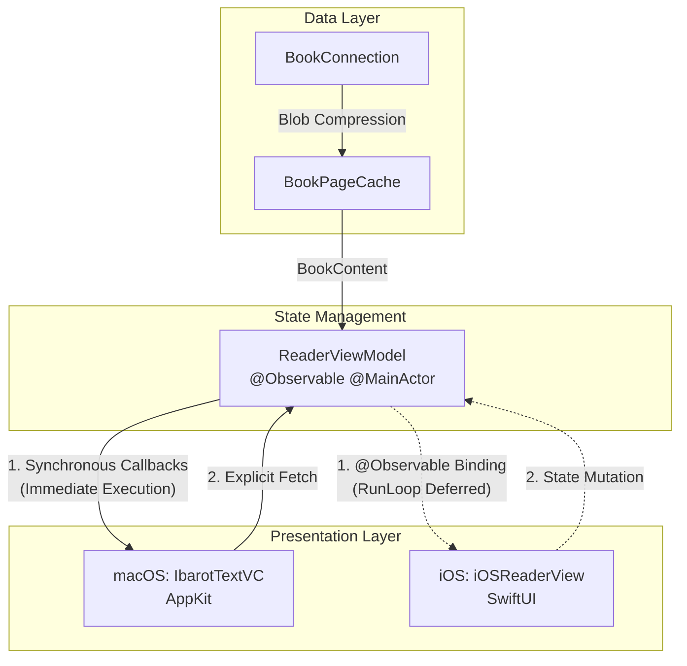

# State Management & Reactive Workflows

`ReaderViewModel` adalah jantung atau konduktor utama yang menjembatani data inti (Database dan *Cache*) ke *View Layer* (AppKit di macOS dan SwiftUI di iOS). Komponen ini beroperasi sepenuhnya pada `@MainActor` untuk menjamin keamanan mutasi antarmuka.

---

## 1. Arsitektur Lintas Platform (Callbacks vs `@Observable`)

Salah satu keputusan arsitektural terpenting dalam modul *Reader* adalah penanganan reaktivitas yang berbeda antara macOS dan iOS untuk mengompromikan kebutuhan *rendering* `NSTextView` dan `UITextView`.

### Mengapa macOS Memanfaatkan *Callbacks* Sinkron?

Meskipun `ReaderViewModel` ditandai dengan `@Observable`, **macOS (AppKit)** sengaja mem- *bypass* observasi langsung untuk pembaruan teks dan lebih memilih **Callbacks**.

AppKit dengan **Tuntutan Sinkronisasi Thread**:

1. AppKit (`NSTextView`) membutuhkan eksekusi sinkron langsung pada *Main Thread* (bukan *dispatched async*) ketika kita memodifikasi `NSTextStorage` atau merestorasi *scroll position*.
2. Apabila kita menggunakan *binding* reaktif dari `@Observable`, notifikasi sistem sering kali di- *dispatch* secara asinkron (*RunLoop deferral*). Hal ini memicu masalah visual parah pada dokumen berskala besar, seperti *flickering* (layar berkedip), kursor yang melompat (*cursor jumping*), dan bentrokan *layout pass*.
3. Oleh karena itu, macOS menyuntikkan fungsi *callback* (misal: `onContentReady()`, `onHighlightRequested()`) ke *ViewModel* agar begitu data terdekompresi, ia dapat mengeksekusi UI secara seketika (*blocking execution* pada *Main Thread*).

### iOS Langsung Menggunakan `@Observable`

**iOS** menggunakan reaktivitas murni dari `@Observable` melalui *bindings* SwiftUI.

1. Layar iOS dibalut sepenuhnya oleh *View* deklaratif (`iOSReaderView`). SwiftUI telah dirancang untuk meredam dan menyinkronkan *state updates* secara aman di *MainActor* sebelum dikirim ke jembatan `UIViewRepresentable` (`iOSIbarotTextView`).
2. `UIViewRepresentable` memiliki metode sakti `updateUIView(_:context:)` yang menjamin bahwa mutasi teks dari *ViewModel* diinjeksi tepat pada siklus pembaruan tata letak (*layout cycle*) yang aman, sehingga terhindar dari *flickering*.

---

## 2. Manajemen Konkurensi & *Task Cancellation*

Saat memuat halaman (terutama ketika pengguna melakukan *fast-scrolling* dengan cepat), Maktabah wajib mencegah *Memory Spike* atau tumpukan (*backlog*) operasi disk.

*   **Task Cancellation**: `ReaderViewModel` menyimpan referensi tugas pemuatan dalam `currentLoadTask`. Jika pengguna pindah halaman sebelum halaman saat ini selesai dimuat, tugas sebelumnya langsung di-*cancel* (`currentLoadTask?.cancel()`).
*   **Debouncing Pagination**: Perpindahan halaman via *slider* di- *debounce* selama beberapa milidetik. Pemuatan database FTS atau dekompresi *Zstandard* (zstd) tidak akan terpicu hingga pengguna berhenti menggeser tuas *slider*.

## 3. Komponen Status Utama (State Properties)

| Properti | Tipe Data | Peran |
| :--- | :--- | :--- |
| `currentPage` | `Int` | Mengemudikan logika navigasi pembaca (ditautkan langsung ke Slider di iOS). |
| `contentText` | `NSAttributedString` | Produk akhir teks dari database yang sudah dirender dan diformat (melalui `ArabicTextRenderer`). |
| `currentAnnotations` | `[Annotation]` | Array *highlight* dan *underline* murni dari `AnnotationStore` yang harus disuntikkan ke teks. |
| `targetAnnotation` | `Annotation?` | Jika tidak `nil`, sistem akan menggulir paksa otomatis (*scroll-to-target*) dan melakukan animasi *flash* pada rentang teks ini. |
