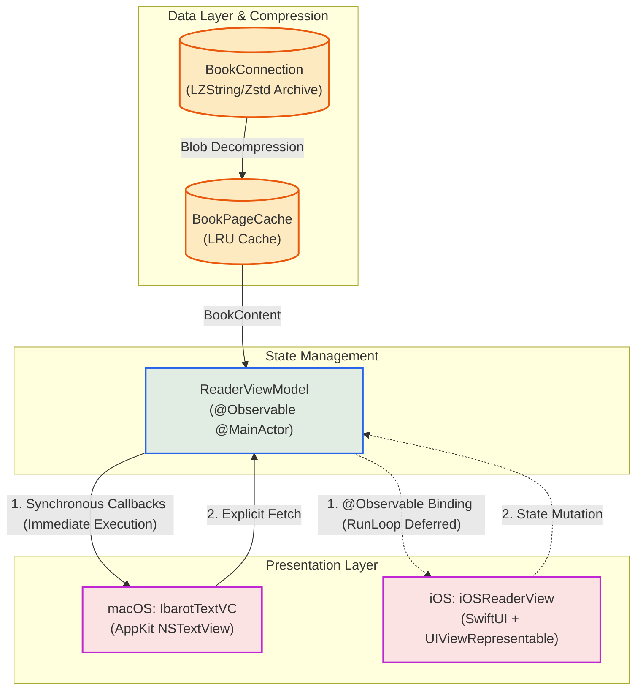
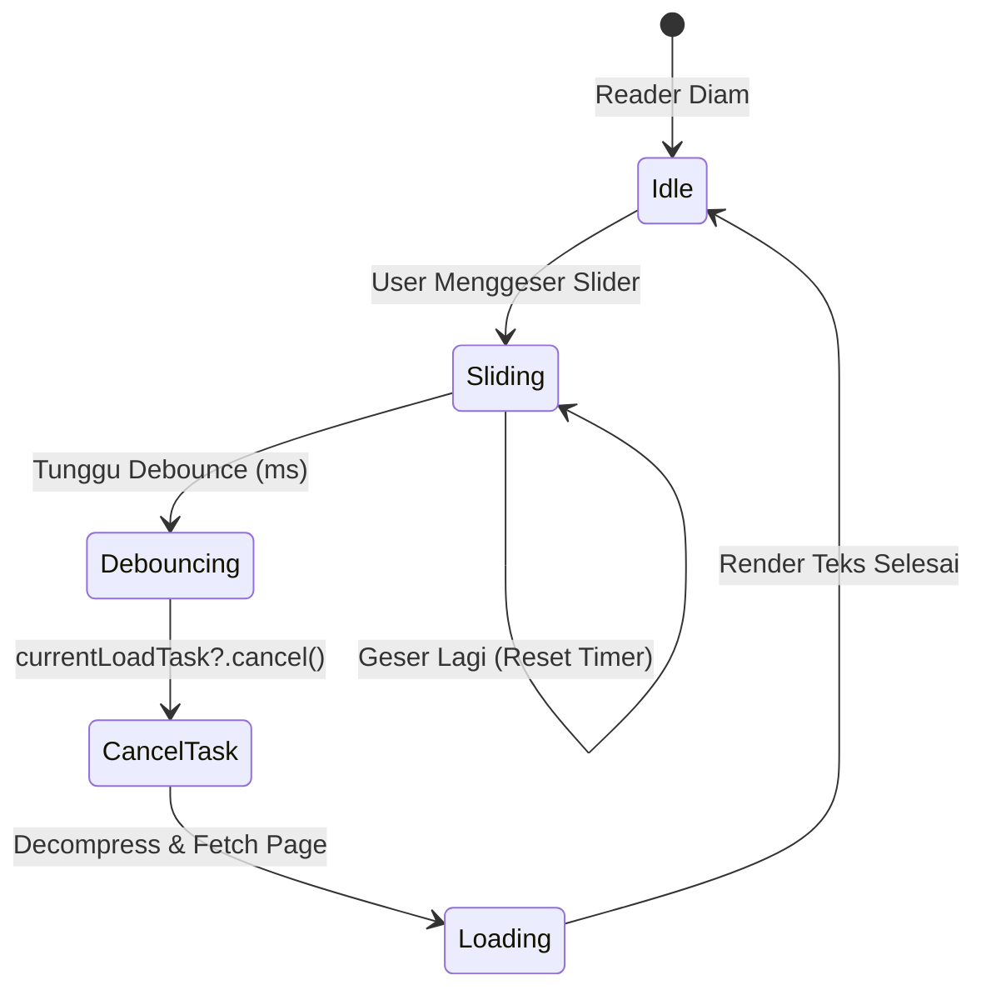

# State Management & Reactive Workflows

`ReaderViewModel` adalah konduktor utama yang menjembatani data inti (*Database* dan *Cache*) ke *View Layer* (AppKit di macOS dan SwiftUI di iOS). Komponen ini beroperasi sepenuhnya di bawah isolasi `@MainActor` untuk menjamin keamanan mutasi antarmuka.

---

## 1. Arsitektur Lintas Platform (Callbacks vs `@Observable`)

Salah satu keputusan arsitektural terpenting dalam modul *Reader* adalah penanganan reaktivitas yang berbeda antara macOS dan iOS untuk mengompromikan kebutuhan *rendering* `NSTextView` dan `UITextView`.

### Mengapa macOS Memanfaatkan *Callbacks* Sinkron?

Meskipun `ReaderViewModel` ditandai dengan `@Observable`, **macOS (AppKit)** sengaja mem-*bypass* observasi langsung untuk pembaruan teks dan lebih memilih pendekatan **Callbacks**.

Karakteristik AppKit dan **Tuntutan Sinkronisasi Thread**:

1. AppKit (`NSTextView`) membutuhkan eksekusi sinkron langsung pada *Main Thread* (bukan *dispatched async*) saat memodifikasi `NSTextStorage` atau merestorasi *scroll position*.
2. Apabila menggunakan *binding* reaktif dari `@Observable`, notifikasi sistem sering kali di-*dispatch* secara asinkron (*RunLoop deferral*). Hal ini memicu masalah visual pada dokumen berskala besar, seperti *flickering* (layar berkedip), kursor yang melompat (*cursor jumping*), dan bentrokan *layout pass*.
3. Oleh karena itu, macOS menyuntikkan fungsi *callback* (misalnya: `onContentReady()`, `onHighlightRequested()`) ke *ViewModel* agar begitu data terdekompresi, antarmuka dapat dieksekusi secara seketika (*blocking execution* pada *Main Thread*).

### iOS Menggunakan `@Observable`

**iOS** menggunakan reaktivitas murni dari `@Observable` melalui *bindings* SwiftUI.

1. Layar iOS dibalut sepenuhnya oleh *View* deklaratif (`iOSReaderView`). SwiftUI dirancang untuk meredam dan menyinkronkan pembaruan *state* secara aman di `@MainActor` sebelum dikirim ke jembatan `UIViewRepresentable` (`iOSIbarotTextView`).
2. `UIViewRepresentable` memanfaatkan metode siklus hidup `updateUIView(_:context:)` yang menjamin bahwa mutasi teks dari *ViewModel* diinjeksikan tepat pada siklus pembaruan tata letak (*layout cycle*) yang aman, sehingga terhindar dari *flickering*.

---

## 2. Manajemen Konkurensi & *Task Cancellation*

Saat memuat halaman (terutama ketika pengguna melakukan *fast-scrolling* dengan cepat), Maktabah wajib mencegah lonjakan memori (*memory spike*) atau tumpukan (*backlog*) operasi disk.

*   **Task Cancellation**: `ReaderViewModel` menyimpan referensi *task* pemuatan dalam `currentLoadTask`. Jika pengguna berpindah halaman sebelum halaman saat ini selesai dimuat, *task* sebelumnya langsung dibatalkan (`currentLoadTask?.cancel()`).
*   **Debouncing Pagination**: Perpindahan halaman melalui *slider* di-*debounce* selama beberapa milidetik. Pemuatan basis data FTS atau dekompresi *Zstandard* (zstd) tidak akan terpicu hingga pengguna berhenti menggeser tuas *slider*.

## 3. Komponen Status Utama (State Properties)

| Properti | Tipe Data | Peran |
| :--- | :--- | :--- |
| `currentPage` | `Int` | Mengatur logika navigasi pembaca (ditautkan langsung ke Slider di iOS). |
| `contentText` | `NSAttributedString` | Produk akhir teks dari basis data yang sudah dirender dan diformat (melalui `ArabicTextRenderer`). |
| `currentAnnotations` | `[Annotation]` | Array *highlight* dan *underline* murni dari `AnnotationStore` yang disuntikkan ke teks. |
| `targetAnnotation` | `Annotation?` | Jika tidak `nil`, sistem akan melakukan *scroll-to-target* otomatis dan memicu animasi *flash* pada rentang teks ini. |
