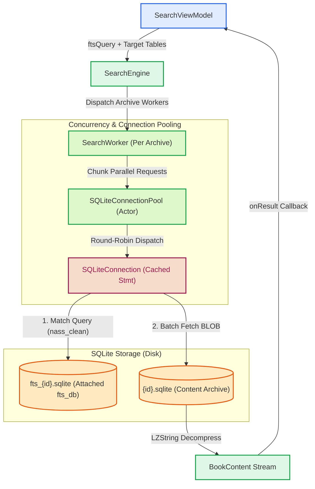

# Persistence & Database Architecture

Meskipun modul **Search** secara konseptual merupakan modul representasi dan orkestrasi kueri (*Presentation & Query Orchestration*), mesin eksekusinya berakar langsung pada infrastruktur SQLite tingkat rendah di lapisan **Core** (`Source/Core/SearchEngine/`). Mesin ini dioptimalkan untuk pencarian teks skala besar (FTS5) yang mencakup jutaan baris kitab dalam puluhan arsip basis data secara konkuren.

---

## 1. Arsitektur Pipeline Pencarian

Berikut adalah alur eksekusi kueri dari ViewModel hingga pembacaan tabel FTS5 dan konten kitab:



---

## 2. Pemisahan Arsip Konten & Tabel Virtual FTS5

Untuk menjaga efisiensi I/O dan mencegah fragmentasi basis data utama, Maktabah menerapkan arsitektur berkas ganda:

1. **Content Archive Database (`{archiveId}.sqlite`)**:
   - Berisi tabel `b{id}` yang menyimpan teks kitab terkompresi `LZString` beserta metadata halaman (`page`, `part`, `volume`).
2. **FTS Database (`fts_{archiveId}.sqlite`)**:
   - Berisi tabel virtual FTS5 `b{id}_fts` yang mengindeks kolom `nass_clean` (teks Arab yang telah dinormalisasi dan dibersihkan dari harakat).
   - Dilampirkan (*attached*) ke koneksi arsip utama saat inisialisasi koneksi menggunakan skema `fts_db`:
     ```swift
     let ftsPath = dbPath.replacing(".sqlite", with: "_fts.sqlite")
     try db?.safeAttachDatabase(path: ftsPath, schema: "fts_db")
     ```

---

## 3. SQLiteConnectionPool & SearchWorker

Eksekusi pencarian memanfaatkan model konkurensi Swift untuk memaksimalkan utilisasi multi-core tanpa menimbulkan *database lock contention*.

### `SQLiteConnectionPool` (Actor)
```swift
actor SQLiteConnectionPool {
    private var connections: [DBConnectionType]

    func read<T: Sendable>(at index: Int, _ body: @escaping @Sendable (DBConnectionType) throws -> T) async throws -> T {
        let conn = getConnection(at: index)
        return try await Task.detached(priority: .userInitiated) { try body(conn) }.value
    }
}
```
- Menampung sejumlah koneksi `SQLiteConnection` yang dibuka secara independen.
- Menjalankan operasi pembacaan secara terisolasi pada *thread* terpisah (`Task.detached` dengan prioritas `.userInitiated`).

### Algoritma Pencarian Dua Tahap (`SearchWorker`)
`SearchWorker` memproses setiap tabel kitab dalam dua langkah efisien:
1. **Fase Pencocokan Indeks (Matching Phase)**:
   Mengeksekusi kueri indeks ringan untuk mengumpulkan seluruh `rowid` yang cocok:
   ```sql
   SELECT rowid FROM b{id}_fts WHERE nass_clean MATCH ?
   ```
2. **Fase Paralel Konten (Chunk Parallel Fetching)**:
   Array `rowid` hasil pencocokan dipecah menjadi potongan-potongan (*chunks*) berukuran tertentu (`batchSize = 200`), kemudian diambil dan didekompresi secara paralel menggunakan koneksi yang berbeda di dalam *connection pool*.

---

## 4. Optimasi SQLite Pragma & Caching

Mesin pencarian mengaplikasikan sejumlah penyetelan *pragma* dan teknik *caching* untuk memastikan latensi minimal:

### Penyetelan Pragma Performa Tinggi
Pada proses migrasi dan pembacaan indeks FTS (`FtsMigrationManager` & `SQLiteDatabase`):
- **`PRAGMA synchronous = OFF;`**: Menghindari operasi *flush disk* sinkron pada saat pembentukan indeks kueri sementara.
- **`PRAGMA journal_mode = MEMORY;`**: Mengalihkan penulisan *rollback journal* ke RAM untuk kecepatan maksimum.
- **`PRAGMA temp_store = MEMORY;`**: Menyimpan tabel sementara (*temp tables*) dan hasil *sorting* di memori utama.
- **`PRAGMA query_only = ON;`**: Menandai koneksi *pool* murni sebagai *read-only* untuk mencegah modifikasi tidak disengaja dan memfasilitasi penguncian memori (*shared cache lock*).

### Statement Caching LRU (`SQLiteConnection`)
Setiap objek `SQLiteConnection` mengelola *cache prepared statement* (`sqlite3_prepare_v2`) hingga 50 *statement* (`maxCacheSize = 50`) dengan algoritma pergantian *LRU* (*Least Recently Used*):
- Penggunaan `executionLock` (`NSLock`) menjamin keamanan konkurensi (*thread-safety*) saat eksekusi dan manipulasi *dictionary*.
- `sqlite3_reset` dan `sqlite3_clear_bindings` dipanggil sebelum penggunaan ulang untuk membersihkan parameter *binding* tanpa perlu mengompilasi ulang *query string* SQLite.
