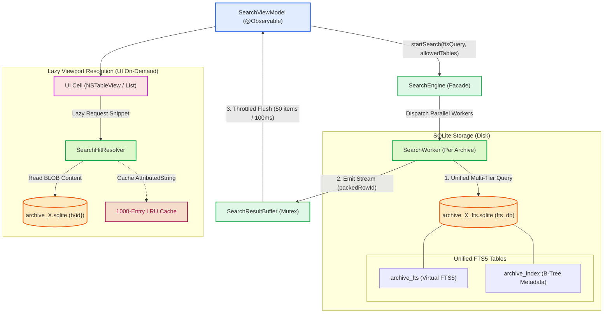

# Persistence & Database Architecture

Meskipun modul **Search** secara konseptual merupakan modul representasi dan orkestrasi kueri (*Presentation & Query Orchestration*), mesin eksekusinya berakar langsung pada infrastruktur SQLite tingkat rendah di lapisan **Core** (`Source/Core/SearchEngine/`). Mesin ini dioptimalkan untuk pencarian teks skala besar (FTS5) yang mencakup jutaan baris kitab dalam puluhan arsip basis data berkecepatan tinggi dengan memanfaatkan **Unified FTS5** dan **Bitwise Range Seek**.

---

## 1. Alur Arsitektur Pencarian (*Search Pipeline*)

Berikut adalah alur eksekusi kueri dari ViewModel hingga pembacaan indeks Unified FTS5 dan resolusi konten teks:


```mermaid
graph TD
    VM["SearchViewModel (@Observable)"] -->|"startSearch(ftsQuery, allowedTables)"| ENGINE["SearchEngine (Facade)"]
    
    ENGINE -->|"Dispatch Parallel Workers"| WORKER["SearchWorker (Per Archive)"]
    
    subgraph StorageLayer ["SQLite Storage (Disk)"]
        WORKER -->|"1. Unified Multi-Tier Query"| FTS_DB[("archive_X_fts.sqlite (fts_db)")]
        subgraph FtsTables ["Unified FTS5 Tables"]
            FTS_TABLE["archive_fts (Virtual FTS5)"]
            INDEX_TABLE["archive_index (B-Tree Metadata)"]
        end
        FTS_DB --- FTS_TABLE
        FTS_DB --- INDEX_TABLE
    end

    WORKER -->|"2. Emit Stream (packedRowId)"| SRB["SearchResultBuffer (Mutex)"]
    SRB -->|"3. Throttled Flush (50 items / 100ms)"| VM

    subgraph ViewportLayer ["Lazy Viewport Resolution (UI On-Demand)"]
        UI["UI Cell (NSTableView / List)"] -->|"Lazy Request Snippet"| SHR["SearchHitResolver"]
        SHR -->|"Read BLOB Content"| CONTENT_DB[("archive_X.sqlite (b{id})")]
        SHR -.->|"Cache AttributedString"| MEM_CACHE["1000-Entry LRU Cache"]
    end

    VM --> UI

    classDef ui fill:#e040fb26,stroke:#c026d3,stroke-width:2px;
    classDef vm fill:#3b82f626,stroke:#2563eb,stroke-width:2px;
    classDef store fill:#22c55e26,stroke:#16a34a,stroke-width:2px;
    classDef db fill:#f9731626,stroke:#ea580c,stroke-width:2px;
    classDef event fill:#be185d26,stroke:#9d174d,stroke-width:2px,color:#9d174d;

    class UI ui;
    class VM vm;
    class ENGINE,WORKER,SRB,SHR store;
    class MEM_CACHE event;
    class FTS_DB,CONTENT_DB db;
```

---

## 2. Arsitektur Unified FTS5 & Bitwise Packed RowID

Untuk mengeliminasi *overhead* ribuan tabel virtual per arsip serta mencegah fragmentasi basis data, Maktabah menerapkan skema terpadu **Unified FTS5**:

### Skema Tabel

Di dalam berkas `{archiveId}_fts.sqlite`:

1. **`archive_fts` (Virtual FTS5 Table)**:
   ```sql
   CREATE VIRTUAL TABLE archive_fts USING fts5(
       nass_clean,
       content='',
       tokenize='unicode61'
   );
   ```
   Tabel ini murni menyimpan *posting list* kata kunci teks Arab yang telah dinormalisasi tanpa menyalin isi teks (`content=''`).

2. **`archive_index` (Regular B-Tree Table)**:
   ```sql
   CREATE TABLE archive_index (
       rowid INTEGER PRIMARY KEY,
       book_id INTEGER,
       page INTEGER,
       id INTEGER,
       part INTEGER
   );
   ```
   Menyimpan pemetaan metadata fisik buku, halaman, dan juz terhadap `rowid` bitwise.

3. **`archive_metadata` (Metadata Table)**:
   ```sql
   CREATE TABLE archive_metadata (
       fts_version INTEGER
   );
   ```
   Menyimpan versi skema FTS (nilai `2` menandakan skema Unified FTS aktif).

### Bitwise Packed RowID: Matematika & Keunggulan

Setiap entri baris di dalam `archive_fts` dan `archive_index` diidentifikasi menggunakan `rowid` 64-bit yang dipadatkan secara bitwise:

$$\text{packedRowId} = (\text{bookId} \ll 32) \mid (\text{rowId} \ \& \ \text{0xFFFFFFFF})$$

- **32-bit Atas (High 32 bits)**: Menyimpan `book_id`.
- **32-bit Bawah (Low 32 bits)**: Menyimpan `rowId` (ID baris unik per halaman kitab).

#### Keunggulan Arsitektur:
1. **Zero Index Overhead:** Tidak ada token buatan (`book_id`) yang diinjeksikan ke dalam *posting list* atau kamus FST SQLite FTS5, menjaga ukuran berkas tetap minimal.
2. **Binary Seek & Pruning Alami:**
   Karena seluruh *posting list* di SQLite FTS5 terurut menaik (*ascending*) berdasarkan `rowid`, kueri dengan rentang:
   $$\text{minRowId} = (\text{bookId} \ll 32) \mid 0$$
   $$\text{maxRowId} = (\text{bookId} \ll 32) \mid \text{0xFFFFFFFF}$$
   memungkinkan mesin FTS5 memanfaatkan antarmuka `xFilter` untuk melakukan *binary search* langsung ke posisi `minRowId`, membaca kecocokan hanya pada rentang tersebut, dan **seketika berhenti (*early cutoff*)** saat membaca baris pertama dengan `rowid > maxRowId`.
3. **Backward Compatibility:** Jika arsip belum dimigrasikan ke Unified FTS, mesin secara otomatis beralih ke skema *legacy* per-kitab (`b{id}_fts`).

---

## 3. SQLiteConnectionPool & SearchWorker

Pencarian dijalankan secara paralel di tingkat arsip basis data menggunakan `SearchWorker`.

### SQLiteConnectionPool (Actor)
```swift
actor SQLiteConnectionPool {
    private var connections: [DBConnectionType]

    func read<T: Sendable>(at index: Int, _ body: @escaping @Sendable (DBConnectionType) throws -> T) async throws -> T {
        let conn = getConnection(at: index)
        return try await Task.detached(priority: .userInitiated) { try body(conn) }.value
    }
}
```
- Menampung koneksi independen ke basis data arsip.
- Mendukung kueri konkuren *read-only* dengan isolasi penuh.

### Strategi Kueri Multi-Tier (`SearchWorker`)

Saat mengeksekusi Unified FTS, `SearchWorker` mengelompokkan pola kueri ke dalam 3 tingkatan (*tiers*) adaptif:

1. **Short-Circuit**: Jika parameter `allowedTables` tidak memuat satupun tabel dari arsip ini, *worker* langsung keluar tanpa membaca *disk*.
2. **Tier 1 (Single Book Seek)**:
   ```sql
   SELECT f.rowid, i.book_id, i.page, i.id, i.part
   FROM archive_fts f
   JOIN archive_index i ON f.rowid = i.rowid
   WHERE f.archive_fts MATCH ? AND f.rowid BETWEEN ? AND ?;
   ```
3. **Tier 2 (2–5 Books Seek)**: Menggabungkan 2 s.d. 5 buku menggunakan `UNION ALL` di mana setiap buku memiliki klausa `BETWEEN ? AND ?` tersendiri guna memotong keterbatasan *single-range constraint* SQLite FTS5.
4. **Tier 3 (>5 Books / Bounding Box)**: Jika rentang ID buku berdekatan (`(maxBook - minBook) < 350`), kueri menerapkan *bounding box* `BETWEEN minGlobalRowId AND maxGlobalRowId` ditambah filter `AND i.book_id IN (...)`.
5. **Global Search**: Jika seluruh kitab dicari (`allowedTables == nil`), kueri FTS langsung mengeksekusi `MATCH` pada tabel `archive_fts` secara global.

---

## 4. Viewport Streaming & Lazy Snippet Resolution

Untuk mencegah *freezing* antarmuka pengguna saat kueri menghasilkan ratusan ribu kecocokan:

1. **`SearchResultBuffer`**:
   Menampung aliran hasil dari seluruh *worker* di latar belakang dan memancarkannya secara berkelompok (*adaptive flush*: saat mencapai 50 item atau setiap 100 ms).
2. **`SearchHitResolver`**:
   Hasil pencarian dikirimkan ke antarmuka sebagai objek ringan `SearchResultItem` tanpa memuat teks kitab secara lengkap. Teks baris kitab baru didekompresi dan disorot (`NSAttributedString`) secara *lazy* saat baris tersebut memasuki *viewport* tampilan (tabel macOS / daftar iOS). Hasil penyorotan disimpan di dalam *cache* LRU 1000 item.

---

## 5. Optimasi SQLite Pragma & Caching

Mesin pencarian mengaplikasikan sejumlah penyetelan *pragma* dan teknik *caching* untuk memastikan latensi minimal:

### Penyetelan Pragma Performa Tinggi
Pada proses migrasi (`FtsMigrationManager`) dan pembacaan indeks FTS (`SQLiteDatabase`):
- **`PRAGMA fts_db.synchronous = OFF;`**: Diterapkan spesifik pada skema target FTS untuk menonaktifkan *flush disk* fisik (`fsync`) selama pembentukan indeks.
- **`PRAGMA fts_db.journal_mode = MEMORY;`**: Mengalihkan penulisan *rollback journal* ke RAM untuk kecepatan mutasi maksimum.
- **`PRAGMA fts_db.temp_store = MEMORY;`**: Menyimpan tabel sementara (*temp tables*) dan struktur kerja di memori utama.
- **`PRAGMA query_only = ON;`**: Menandai koneksi *pool* murni sebagai *read-only* untuk mencegah modifikasi tidak disengaja dan memfasilitasi penguncian memori (*shared cache lock*).

### Statement Caching LRU (`SQLiteConnection`)
Setiap objek `SQLiteConnection` mengelola *cache prepared statement* (`sqlite3_prepare_v2`) hingga 50 *statement* (`maxCacheSize = 50`) dengan algoritma pergantian *LRU* (*Least Recently Used*):
- Penggunaan `executionLock` (`NSLock`) menjamin keamanan konkurensi (*thread-safety*) saat eksekusi dan manipulasi *dictionary*.
- `sqlite3_reset` dan `sqlite3_clear_bindings` dipanggil sebelum penggunaan ulang untuk membersihkan parameter *binding* tanpa perlu mengompilasi ulang *query string* SQLite.
