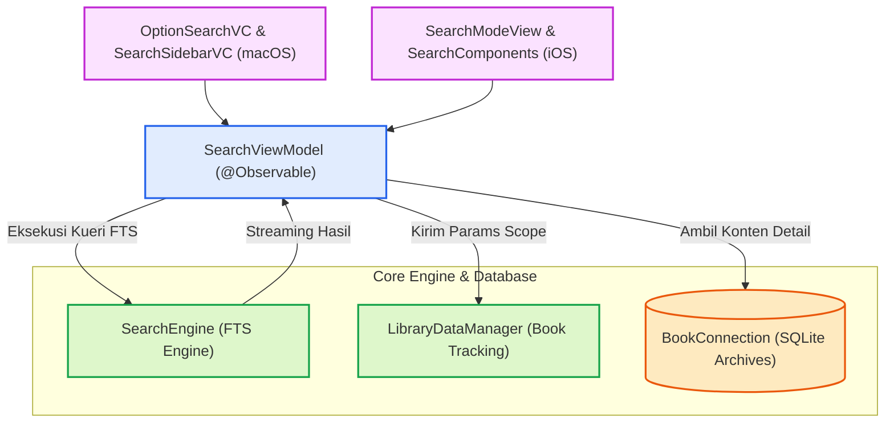

# Search

Modul **Search** menangani pencarian *Full-Text Search* (FTS) dalam pustaka kitab yang tersedia. Modul ini terintegrasi erat dengan `SearchEngine` dari *Core* dan mengelola pencarian di ribuan tabel secara konkuren dengan kapabilitas jeda/lanjutkan (*pause/resume*), serta filter kriteria pencarian yang komprehensif (Frasa, Mengandung, OR, dan Jarak Kedekatan / *Near*).

## Arsitektur & Alur Pemrosesan (*Pipeline*)

Modul ini dibangun menggunakan pola arsitektur MVVM (*Model-View-ViewModel*) dengan `SearchViewModel` sebagai pengendali *state* dan konduktor pencarian lintas platform.

## Fitur Utama

- **Pencarian Konkuren:** Memanfaatkan `SearchEngine` dengan *multithreading* dan `Task.detached`.
- **Mode Pencarian:** Frasa utuh (*Exact Phrase*), Semua Kata (*AND / All Words*), Salah Satu Kata (*OR / Any Word*), dan Kedekatan (*Near Distance*).
- **Bookmarks (Saved Results):** Memulihkan dan menampilkan kembali hasil pencarian yang disimpan.
- **State Restoration:** Kemampuan memulihkan sesi pencarian terakhir secara otomatis.
