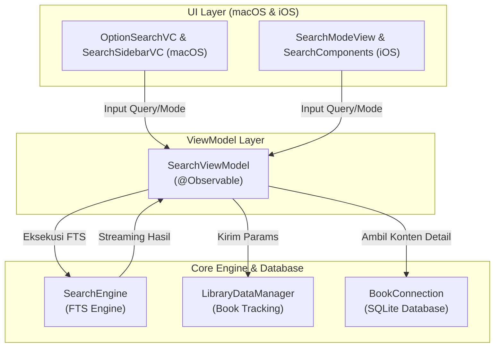

# Search

Modul **Search** menangani pencarian *Full Text Search* (FTS) dalam pustaka kitab yang tersedia. Modul ini terintegrasi erat dengan `SearchEngine` dari *Core* dan mengelola pencarian di ribuan tabel secara konkuren dengan kapabilitas *pause/resume*, serta filter kriteria pencarian yang komprehensif (Frasa, Mengandung, OR, dan Jarak Kedekatan / Near).

## Arsitektur & Pipeline

Modul ini dibangun menggunakan pendekatan MVVM (Model-View-ViewModel) dengan `SearchViewModel` sebagai pengendali *state* dan konduktor pencarian lintas platform.

## Fitur Utama

- **Pencarian Konkuren:** Memanfaatkan `SearchEngine` dengan multithreading dan `Task.detached`.
- **Mode Pencarian:** Frasa utuh, Semua Kata (AND), Salah Satu Kata (OR), dan Kedekatan (Near) untuk fleksibilitas.
- **Bookmarks (Saved Results):** Memulihkan dan menampilkan kembali hasil pencarian yang disimpan.
- **State Restoration:** Kemampuan memulihkan pencarian terakhir secara otomatis.
