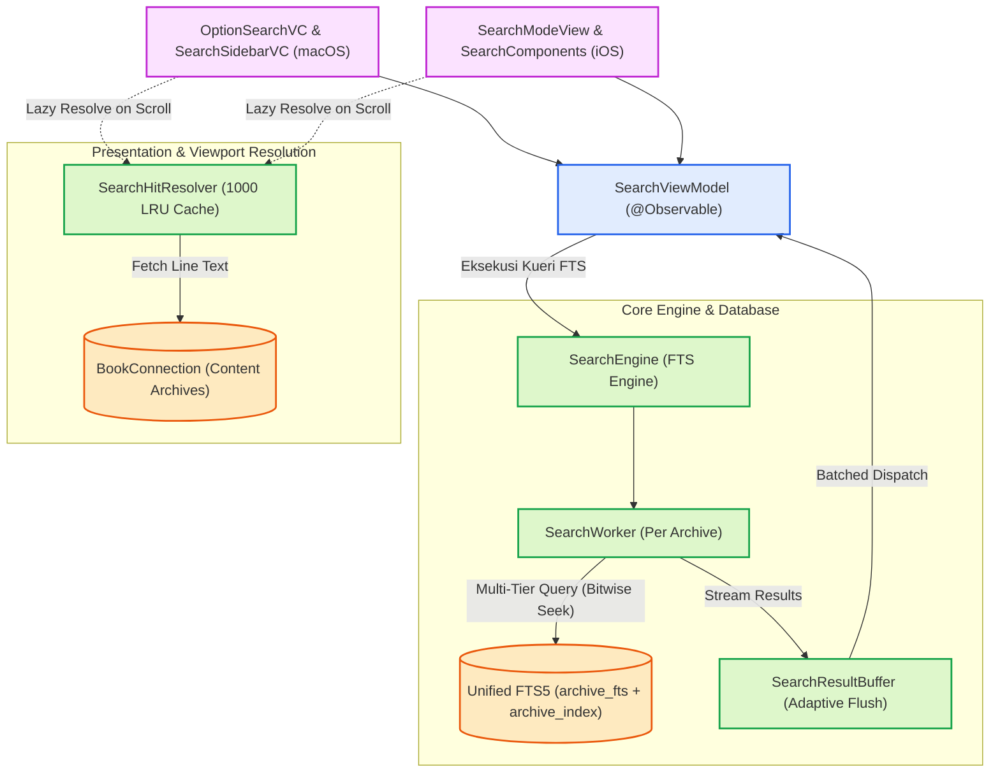

# Search

Modul **Search** menangani pencarian *Full-Text Search* (FTS) dalam pustaka kitab yang tersedia. Modul ini terintegrasi erat dengan `SearchEngine` dari *Core* dan mengelola pencarian berskala besar melintasi arsip basis data berkecepatan tinggi menggunakan skema **Unified FTS5**, pengindeksan *bitwise packed rowid*, *adaptive result buffering*, dan *lazy snippet resolution*.

## Arsitektur & Alur Pemrosesan (*Pipeline*)

Modul ini dibangun menggunakan pola arsitektur MVVM (*Model-View-ViewModel*) dengan `SearchViewModel` sebagai pengendali *state* dan konduktor pencarian lintas platform.

```mermaid
flowchart TD
    MAC["OptionSearchVC & SearchSidebarVC (macOS)"] --> SVM["SearchViewModel (@Observable)"]
    IOS["SearchModeView & SearchComponents (iOS)"] --> SVM
    
    SVM ~~~ Core
    
    subgraph Core ["Core Engine & Database"]
        SE["SearchEngine (FTS Engine)"]
        SW["SearchWorker (Per Archive)"]
        UFTS[("Unified FTS5 (archive_fts + archive_index)")]
        SRB["SearchResultBuffer (Adaptive Flush)"]
    end
    
    subgraph Resolvers ["Presentation & Viewport Resolution"]
        SHR["SearchHitResolver (1000 LRU Cache)"]
        BC[("BookConnection (Content Archives)")]
    end

    SVM -->|"Eksekusi Kueri FTS"| SE
    SE --> SW
    SW -->|"Multi-Tier Query (Bitwise Seek)"| UFTS
    SW -->|"Stream Results"| SRB
    SRB -->|"Batched Dispatch"| SVM

    MAC -.->|"Lazy Resolve on Scroll"| SHR
    IOS -.->|"Lazy Resolve on Scroll"| SHR
    SHR -->|"Fetch Line Text"| BC

    classDef ui fill:#e040fb26,stroke:#c026d3,stroke-width:2px;
    classDef vm fill:#3b82f626,stroke:#2563eb,stroke-width:2px;
    classDef store fill:#22c55e26,stroke:#16a34a,stroke-width:2px;
    classDef db fill:#f9731626,stroke:#ea580c,stroke-width:2px;
    classDef event fill:#be185d26,stroke:#9d174d,stroke-width:2px,color:#9d174d;

    class MAC,IOS ui;
    class SVM vm;
    class SE,SW,SRB,SHR store;
    class UFTS,BC db;
```

## Fitur Utama

- **Pencarian Terpadu (Unified FTS5):** Menggabungkan ribuan indeks per-kitab ke dalam satu tabel virtual `archive_fts` per arsip dengan teknik *bitwise range seek* (`packedRowId`), memotong drastis fragmentasi *disk* dan waktu pencarian.
- **Strategi Multi-Tier Kueri:** Optimasi berlapis (Tier 1 untuk 1 buku, Tier 2 via `UNION ALL` untuk 2–5 buku, Tier 3 untuk >5 buku) serta *early short-circuit* lintas arsip.
- **Penyangga Aliran Adaptif (`SearchResultBuffer`):** Mencegah *stuttering* pada antarmuka pengguna dengan mekanisme *throttling* (50 item atau 100 ms).
- **Resolusi Cuplikan Malas (`SearchHitResolver`):** Mengeliminasi dekompresi teks di muka dengan mengurai cuplikan teks berformat (`NSAttributedString`) hanya saat baris memasuki *viewport* layar pengguna.
- **Mode Pencarian Fleksibel:** Frasa utuh (*Exact Phrase*), Semua Kata (*AND / All Words*), Salah Satu Kata (*OR / Any Word*), dan Kedekatan (*Near Distance*).
- **Bookmarks (Saved Results) & State Restoration:** Memulihkan dan menampilkan kembali hasil pencarian yang disimpan serta sesi pencarian terakhir secara otomatis.
