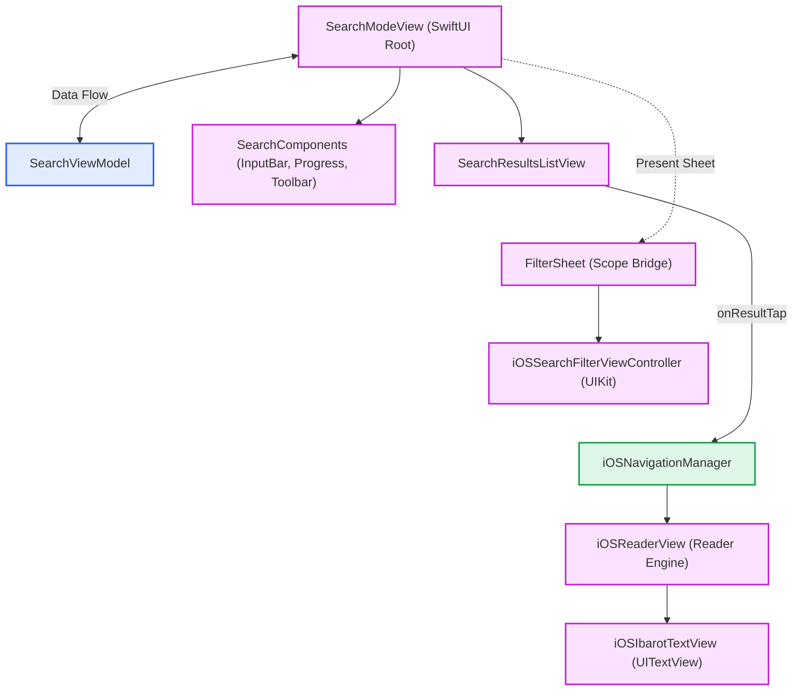
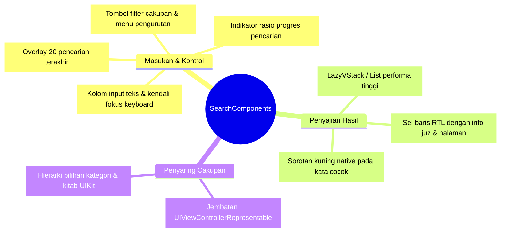
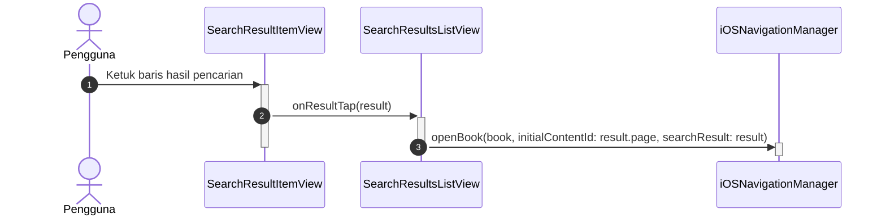
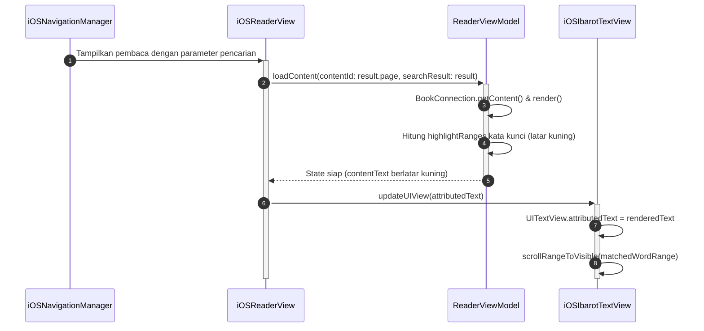

# Search iOS Implementation (SwiftUI & UIKit)

Implementasi antarmuka modul Search untuk platform iOS dan iPadOS memadukan fleksibilitas deklaratif SwiftUI (melalui komponen terisolasi di `SearchComponents.swift`) dengan kestabilan performa UIKit untuk hierarki penyaring cakupan pustaka (*Search Scope*).

Sumber kode: `Source/Features/Search/iOS/`

---

## 1. Arsitektur Komponen Visual

Arsitektur antarmuka pencarian pada iOS membagi tanggung jawab ke dalam komponen masukan terisolasi dan daftar hasil reaktif:

### A. Hierarki Komponen Pencarian

### B. Taksonomi Sub-Komponen `SearchComponents.swift`

---

## 2. Alur Interaksi: Dari Aksi Klik Hasil Pencarian ke TextView

Ketika pengguna mengetuk salah satu baris hasil pencarian di `SearchResultsListView`:

---

## 3. Bedah Komponen Antarmuka Utama

### 1. `SearchModeView` (Root View)

* Menjadi kontainer utama antarmuka pencarian yang mengelola lapisan `ZStack` dan `Overlay`.
* Mengatur *toolbar* pengurutan dinamis, penyajian lembar modal (*sheets*) menuju histori pencarian tersimpan (*Saved Results*), dan pemberitahuan migrasi basis data FTS bila diperlukan.

### 2. Sub-Komponen Modular (`SearchComponents.swift`)

* **`SearchInputBar`**: Kolom input pencarian utama dengan integrasi `@FocusState` untuk manajemen *keyboard*, tombol pembersih teks instan, dan indikator status aktif.
* **`SearchHistoryOverlay`**: Hamparan mengambang yang menampilkan daftar 20 kueri pencarian terakhir saat kolom teks aktif, memudahkan pencarian berulang tanpa mengetik ulang.
* **`SearchProgressView`**: Bilah kemajuan yang menampilkan rasio pencarian secara riil (jumlah arsip/halaman yang telah dipindai dari total koleksi).
* **`SearchToolbar`**: Bilah tombol aksi untuk menyaring cakupan pustaka, mengubah mode pencarian (Frasa, Dan/Atau, Dekat), serta mengatur urutan hasil pencarian.

### 3. `SearchResultsListView` & Rendering Teks Tersorot

* Menyajikan baris hasil pencarian dengan tata letak teks Arab Kanan-ke-Kiri (RTL).
* **Kompatibilitas AttributedString**: Mengonversi `NSAttributedString` (*Foundation*) dari hasil pencarian FTS menjadi struktur nilai SwiftUI `AttributedString`, memungkinkan *rendering* sorotan warna kuning pada suku kata yang cocok secara *native* tanpa hambatan performa tata letak.

### 4. `iOSSearchFilterViewController` (Penyaring Cakupan / Scope)

* Menggunakan `UIViewControllerRepresentable` untuk memuat struktur hierarki pustaka UIKit (*hierarchical outline*).
* Menangani seleksi multi-pilihan kategori atau kitab dengan performa tinggi saat menyaring ratusan kategori secara bersamaan.
