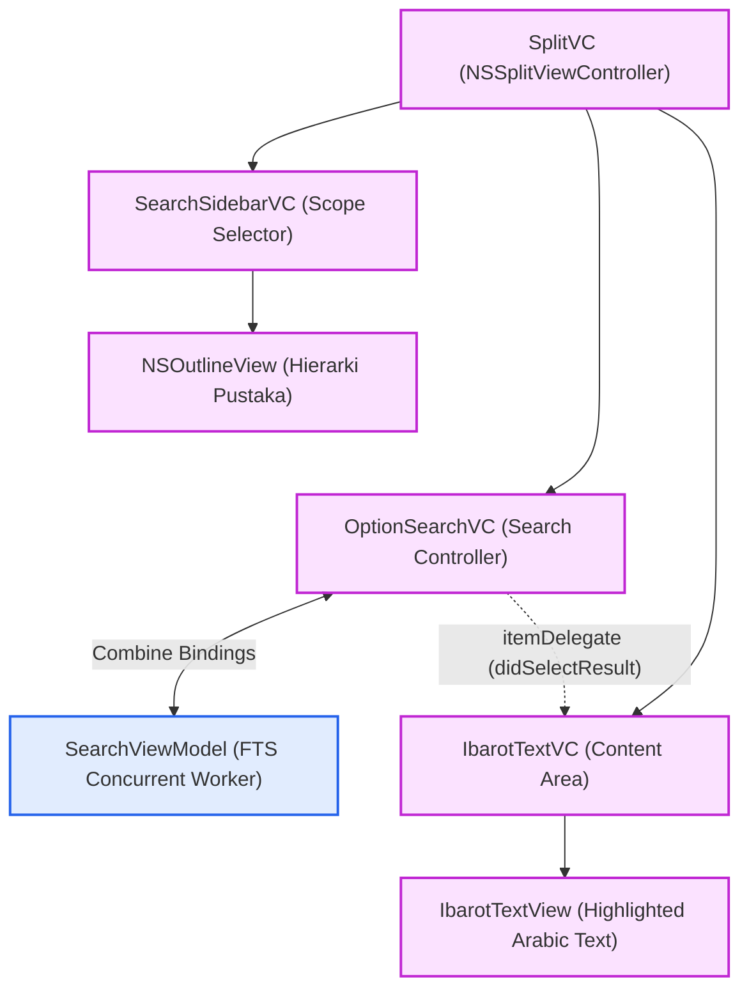
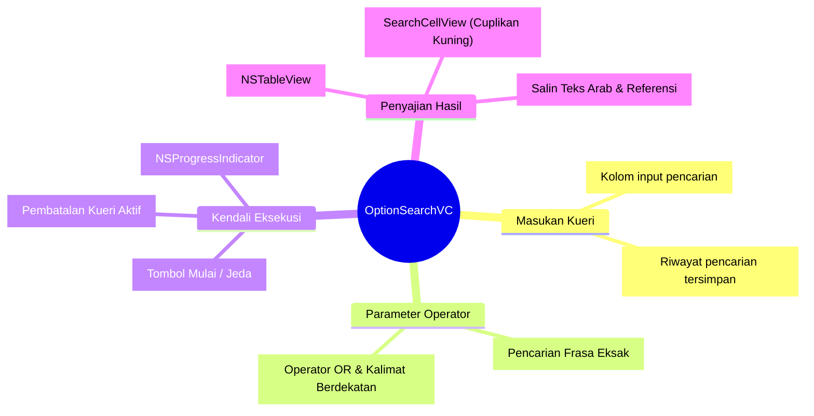
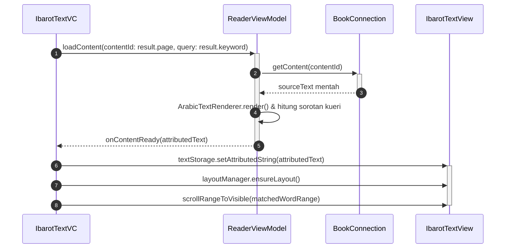

# Search macOS Implementation (AppKit)

Modul Search di lingkungan macOS menggunakan infrastruktur antarmuka AppKit terpadu dalam `SplitVC`. Komponen visual memisahkan pemilihan cakupan pustaka (*Search Scope*), kontrol parameter masukan, dan penayangan daftar hasil yang diperbarui secara asinkron dari `SearchViewModel`.

Sumber kode: `Source/Features/Search/macOS/`

---

## 1. Arsitektur Komponen Visual

Antarmuka pencarian macOS dikoordinasikan di dalam `SplitVC` dengan pemisahan panel cakupan, panel kontrol hasil, dan area pembaca:

### A. Hierarki Komponen Pencarian



### B. Taksonomi Kontrol & Parameter `OptionSearchVC`



---

## 2. Alur Interaksi: Dari Aksi Klik Hasil Pencarian ke TextView

Ketika pengguna mengklik salah satu baris cuplikan hasil pencarian pada tabel `OptionSearchVC`:

```mermaid
sequenceDiagram
    autonumber

    actor User as Pengguna
    participant Tbl as NSTableView
    participant Opt as OptionSearchVC
    participant Rdr as IbarotTextVC

    User->>+Tbl: Klik baris hasil pencarian
    Tbl->>+Opt: didSelectItem(row) / tableViewSelectionDidChange()
    Opt->>+Rdr: itemDelegate?.didSelectResult(result)
    Rdr->>Rdr: displayBook(book, targetPage: result.page)
    deactivate Rdr
    deactivate Opt
    deactivate Tbl
```



---

## 3. Bedah Komponen Antarmuka Utama

### 1. OptionSearchVC (Class) - Search Controller

* Berperan sebagai kontroler pusat pencarian yang dapat ditempatkan di panel bawah `SplitVC` atau di dalam `OptionSearchPopover`.
* **Pemantauan Combine Asinkron**: Mengamati sinyal `searchDidReceiveResult` dan `searchProgressDidUpdate` dari `SearchViewModel` untuk memperbarui baris tabel secara bertahap tanpa memblokir antarmuka utama.
* **Kendali Eksekusi**: Tombol jeda/lanjutkan (*Pause/Resume*) dan pembatalan (*Cancel*) pencarian FTS *multithread*.
* **Menu Konteks Hasil**: Menyediakan *context menu* klik kanan "Salin" (*Copy*) yang mematuhi *protocol* `CopyableResult` untuk menyusun kutipan teks Arab beserta referensi juz dan halaman.

### 2. SearchSidebarVC (Class) - Penyaring Cakupan / Scope

* Menampilkan hierarki kategori dan kitab menggunakan `NSOutlineView` yang ditenagai oleh `LibraryViewManager`.
* Pengguna dapat memilih satu kitab, sekumpulan kategori, atau seluruh perpustakaan sebagai batasan cakupan (*scope*) kueri pencarian FTS.

### 3. SearchCellView (Class) - Render Cuplikan & Highlight

* *Subclass* `NSTableCellView` yang dirancang untuk me-*render* teks hasil dengan tipografi Arab RTL.
* Menggunakan `NSAttributedString` untuk memberikan latar belakang sorotan kuning pada setiap kata kunci yang cocok dengan kueri pengguna.

### 4. OptionSearchPopover (Class)

* Abstraksi pembungkus berbasis `NSPopover` yang memungkinkan fungsionalitas pencarian `OptionSearchVC` dipanggil secara instan dari bilah menu atau tombol *toolbar* jendela.
