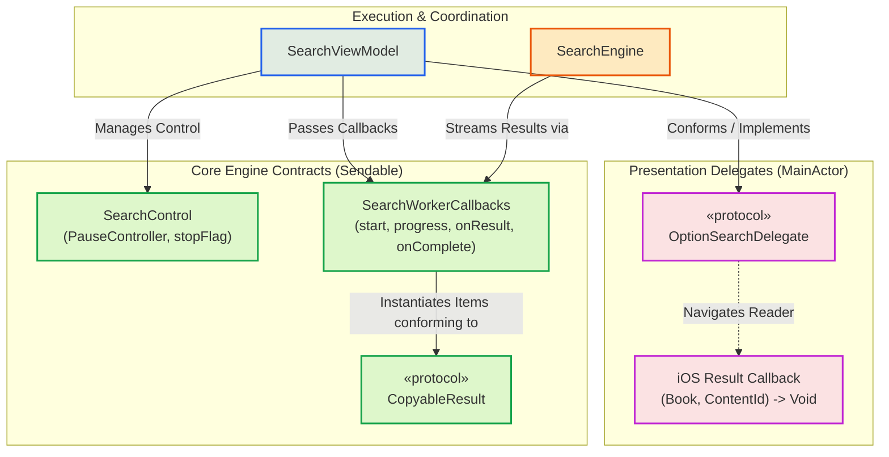

# Protocols & Contracts

Arsitektur pencarian Maktabah menghubungkan antarmuka presentasi (macOS AppKit dan iOS SwiftUI) dengan mesin eksekusi FTS melalui sekumpulan *protocol* delegasi dan kontrak *callback* konkuren berstatus `Sendable`.

---

## 1. Arsitektur Kontrak Delegasi & Callback

Berikut adalah pembagian peran antarmuka antara lapisan UI, ViewModel, dan Search Engine:



---

## 2. Antarmuka Presentasi

### `OptionSearchDelegate` (Protocol) - macOS
*Protocol* ini diisolasi ke dalam *Main Thread* (`@MainActor`) dan diimplementasikan oleh *controller* pengelola jendela (seperti `SplitVC` atau `SearchSidebarVC`):

```swift
@MainActor
protocol OptionSearchDelegate: AnyObject {
    func didSelectResult(
        for id: Int,
        highlightText: String,
        mode: SearchMode?,
        nearDistance: Int
    ) async
}
```

- **`id`**: Pengenal baris halaman kitab (`contentId`).
- **`highlightText`**: Kueri teks kata kunci yang disorot (*highlighting*) saat pembaca teks (`IbarotTextVC`) dibuka.
- **`mode` & `nearDistance`**: Parameter mode pencarian (`.allWords`, `.anyWord`, `.exactPhrase`, `.near`) yang menentukan kalkulasi toleransi penyorotan kata majemuk atau berjarak dekat.

### Callback Presentasi (iOS)
Pada iOS, navigasi hasil pencarian memanfaatkan *closure* interaksi:
- `onResultTap: (Int, Int) -> Void`: Mentranslasikan ketukan pada baris `SearchResultsListView` menjadi pemanggilan `iOSNavigationManager.openBook(book, initialContentId: contentId)`.

---

## 3. Kontrak Eksekusi Engine (`Sendable`)

Komunikasi antara `SearchEngine` dan *thread* latar belakang diatur melalui *struct* kontrak yang mematuhi batasan model konkurensi Swift:

### `SearchControl` (Struct)
Mengontrol jalannya pencarian secara asinkron tanpa *race condition*:
```swift
struct SearchControl: Sendable {
    let pauseController: PauseController
    let stopFlag: @Sendable () -> Bool
}
```
- **`pauseController`**: Mengelola status jeda/lanjutkan saat pengguna beralih tugas atau membatasi penggunaan CPU.
- **`stopFlag`**: Predikat *thread-safe* untuk menghentikan putaran *worker loop* secara instan ketika pengguna membatalkan pencarian atau mengetik kueri baru.

### `SearchWorkerCallbacks` (Struct)
Pipeline penerima hasil (*streaming pipeline*) dari *worker* FTS:
```swift
struct SearchWorkerCallbacks: Sendable {
    let start: @Sendable (Int) -> Void
    let progress: @Sendable (Int) -> Void
    let onRowProgress: @Sendable (String, Int, Int) -> Void
    let onResult: @Sendable (String, BookContent) -> Void
    let onTableComplete: @Sendable () -> Void
    let onComplete: @Sendable () -> Void
}
```
- **`onResult`**: Dipanggil setiap kali sebaris konten kitab yang cocok selesai didekompresi, memungkinkan UI memperbarui daftar hasil secara progresif tanpa menunggu seluruh basis data selesai dipindai.

---

## 4. Abstraksi Data & Utilitas

### `CopyableResult` (Protocol)
*Protocol* yang menyeragamkan fungsionalitas penyalinan teks (*clipboard copy*) dari berbagai bentuk hasil:
- Memastikan item dapat menghasilkan format sitasi rujukan lengkap (berisi nama kitab, juz, nomor halaman, dan kutipan teks Arab).
- Diadopsi oleh hasil pencarian reguler, hasil pencarian perawi/hadis, maupun riwayat pencarian yang disimpan.
