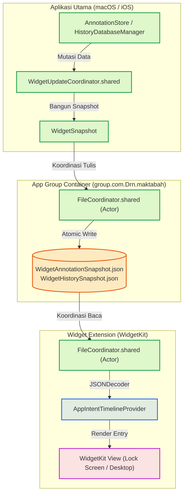

# Persistensi Snapshot & App Group Container

Arsitektur penyimpanan untuk Widget **tidak** membaca langsung ke SQLite (*Core Database*) milik aplikasi utama. Pendekatan ini sengaja dirancang untuk mengatasi dua kendala krusial:
1. **Batasan Memori Widget**: Sistem operasi membatasi penggunaan RAM untuk ekstensi widget secara sangat ketat (maksimal ~30 MB). Memuat *engine* SQLite, koneksi multiproses, dan *cache* halaman di dalam widget berisiko tinggi memicu terminasi paksa (*JetSam / Out-Of-Memory*).
2. **Pencegahan Kunci Basis Data (*Database Lock*)**: Akses bersamaan antara aplikasi utama yang sedang menulis dan widget yang sedang membaca berpotensi memicu kondisi `database is locked`.

Sebagai gantinya, widget beroperasi menggunakan mekanisme **Snapshot JSON** terisolasi yang disimpan ke dalam *App Group Shared Container* dan dikoordinasikan secara asinkron menggunakan *actor* `FileCoordinator`.

---

## 1. Alur Persistensi Snapshot (*Snapshot Persistence Pipeline*)



---

## 2. Koordinasi Berkas Lintas Proses (`FileCoordinator`)

Karena aplikasi utama dan ekstensi widget berjalan pada proses (*process ID*) yang berbeda, operasi I/O berkas diamankan menggunakan `NSFileCoordinator` yang dibungkus di dalam Swift `actor`:

```swift
public actor FileCoordinator {
    public nonisolated static let shared = FileCoordinator()

    public func read(url: URL) -> Data? {
        var error: NSError?
        var fileData: Data?
        let coordinator = NSFileCoordinator(filePresenter: nil)
        coordinator.coordinate(readingItemAt: url, options: .withoutChanges, error: &error) { newURL in
            fileData = try? Data(contentsOf: newURL)
        }
        return fileData
    }

    public func write(data: Data, to url: URL) {
        let dirURL = url.deletingLastPathComponent()
        try? FileManager.default.createDirectory(at: dirURL, withIntermediateDirectories: true)

        var error: NSError?
        let coordinator = NSFileCoordinator(filePresenter: nil)
        coordinator.coordinate(writingItemAt: url, options: .forReplacing, error: &error) { newURL in
            try? data.write(to: newURL)
        }
    }
}
```

- **Thread-Safety & Multiprocess**: Menghindari *race condition* saat aplikasi utama menulis snapshot baru persis ketika widget sedang me-refresh timeline.
- **Direktori Isolasi**: Snapshot diletakkan di dalam folder terproteksi `Library/Application Support/` di dalam App Group `group.com.Drn.maktabah`.

---

## 3. Resolusi Konflik Snapshot & Generasi (`resolve`)

Setiap snapshot membawa metadata nomor generasi (`generation: Int64`) dan stempel waktu (`lastUpdated: Date`). Apabila terjadi pembaruan dari CloudKit secara bersamaan, algoritma deterministik `resolve` mengevaluasi versi mana yang berhak menimpa disk lokal:

```swift
let isRemoteNewer: Bool = if remote.generation != currentLocal.generation {
    remote.generation > currentLocal.generation
} else {
    remote.lastUpdated > currentLocal.lastUpdated
}

if isRemoteNewer {
    let itemsChanged = remote.items != currentLocal.items
    await remote.saveLocal()
    return (remote, itemsChanged)
} else {
    return (currentLocal, false)
}
```

Dengan pola ini:
1. Snapshot lokal hanya ditulis ulang jika terjadi perbedaan isi (`items != currentLocal.items`), menghemat siklus disk I/O.
2. Ekstensi widget dapat menampilkan kutipan anotasi dan riwayat terakhir secara instan (< 10 ms) tanpa perlu menginisialisasi pustaka SQLite.
