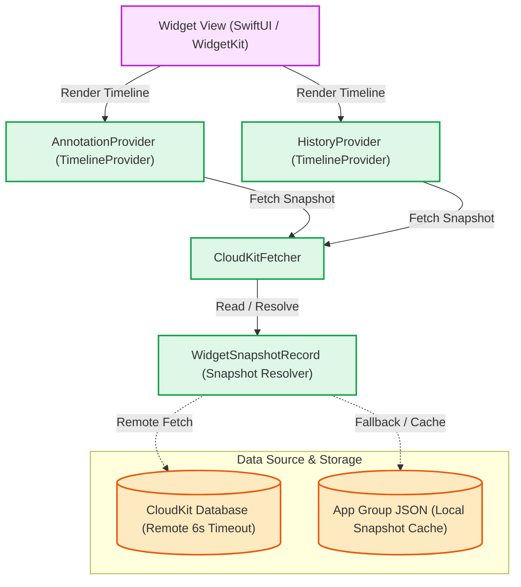

# Widget

## Ringkasan
Fitur Widget pada Maktabah menyediakan akses cepat ke konten spesifik langsung dari *Home Screen*, *Lock Screen*, atau *Notification Center* perangkat pengguna. Terdapat dua widget utama:

1. **Annotation Widget**: Menampilkan anotasi (sorotan teks dan catatan) terbaru.
2. **History Widget**: Menampilkan buku-buku yang terakhir kali dibaca.

Widget dibangun menggunakan SwiftUI dan WidgetKit, serta mengandalkan sinkronisasi data independen berbasis *Snapshot* (tanpa mengakses basis data utama secara langsung).

## Arsitektur Pipeline

Alur kerja widget melibatkan penyediaan *snapshot* mandiri yang disinkronkan melalui App Group secara lokal dan ditarik dari CloudKit bila tersedia.

## Sub-Komponen Dokumentasi

- **[Data Models & Snapshots](models.md)**: Model *snapshot* terisolasi (`AnnotationSnapshot`, `HistorySnapshot`).
- **[State Management & Coordination](viewmodel.md)**: Mekanisme `WidgetUpdateCoordinator` dan siklus hidup `TimelineProvider`.
- **[Database & App Group Persistence](database.md)**: Penyimpanan berkas JSON App Group dengan `NSFileCoordinator`.
- **[iOS Integration](ios.md)**: Penanganan *deep link* dan penempatan widget di iOS.
- **[macOS Integration](macos.md)**: Adaptasi widget desktop macOS dan delegasi URL *event*.
- **[Protocols & Contracts](protocols.md)**: Kontrak `WidgetSnapshotRecord` dan `AppIntentTimelineProvider`.
