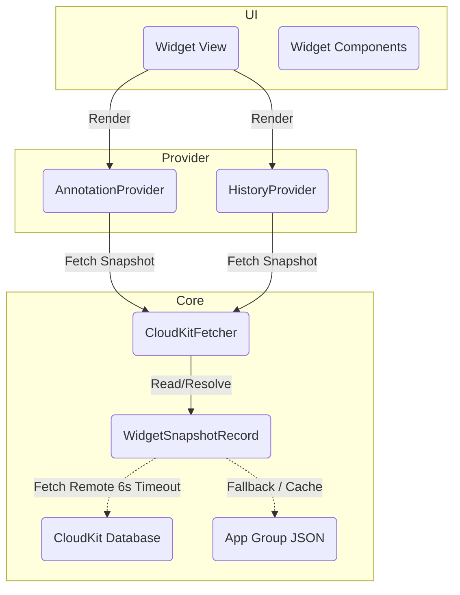

# Widget

## Ringkasan
Fitur Widget pada Maktabah menyediakan akses cepat ke konten spesifik langsung dari Home Screen atau Notification Center perangkat pengguna. Terdapat dua widget utama:
1. **Annotation Widget**: Menampilkan anotasi (sorotan/catatan) terbaru.
2. **History Widget**: Menampilkan buku-buku yang terakhir dibaca.

Widget dibangun menggunakan SwiftUI dan WidgetKit, serta mengandalkan sinkronisasi data independen berbasis Snapshot (bukan mengakses database utama secara langsung).

## Arsitektur Pipeline

Alur kerja widget melibatkan penyediaan snapshot mandiri yang disinkronisasi melalui App Group secara lokal dan ditarik dari CloudKit jika memungkinkan.

