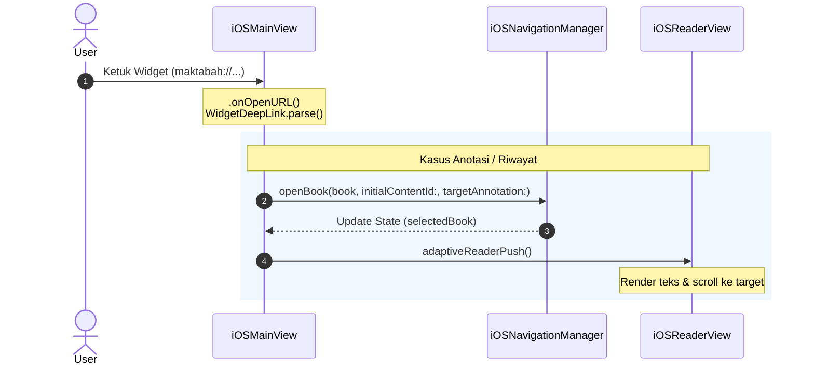

# iOS Integration

Pada iOS (iOS 17.0+), modul Widget terintegrasi penuh ke dalam sistem operasi melalui widget di Home Screen, Lock Screen, maupun StandBy Mode. Antarmuka dan alur navigasi deep link dibangun sepenuhnya menggunakan SwiftUI modern.

---

## 1. Alur Penanganan Deep Link

Ketika pengguna mengetuk widget di Home Screen atau Lock Screen iOS, aplikasi Maktabah diaktifkan dan menangkap tautan melalui modifier `.onOpenURL`. Alur diproses dalam diagram sekuens modular dengan 4 partisipan:



---

## 2. Pemrosesan URL di SwiftUI (`iOSMainView`)

Penanganan skema URL diintegrasikan pada root view aplikasi:

```swift
private func handleOpenURL(_ url: URL, bManager: iOSNavigationManager) {
    guard let deepLink = WidgetDeepLink.parse(from: url) else { return }

    Task {
        switch deepLink {
        case let .annotation(annId):
            if let annotation = AnnotationStore.shared.loadAnnotationById(annId),
               let book = LibraryDataManager.shared.getBook([annotation.bkId]).first
            {
                await MainActor.run {
                    bManager.openBook(
                        book,
                        initialContentId: Int(annotation.contentId),
                        targetAnnotation: annotation
                    )
                }
            }

        case let .history(bkId, contentId):
            if let book = LibraryDataManager.shared.getBook([bkId]).first {
                await MainActor.run {
                    bManager.openBook(book, initialContentId: contentId)
                }
            }
        }
    }
}
```

1. **Resolusi Entitas**: ID buku dan konten diambil secara efisien melalui `LibraryDataManager.shared.getBook([bkId])`.
2. **MainActor Dispatch**: Pembaruan state navigasi dipindahkan ke `@MainActor` agar perubahan binding UI berjalan mulus tanpa gangguan visual (*visual glitch*).
3. **Adaptive Reader Push**: `iOSNavigationManager` memicu navigasi tumpukan (*navigation stack push*) pada iPhone atau pembaruan split-detail reader pada iPad.

---

## 3. Komponen Antarmuka SwiftUI

Antarmuka widget dioptimalkan untuk berbagai ukuran keluarga widget (`WidgetFamily`):

- **`AnnotationView` & `HistoryView`**: Root view yang mengevaluasi ukuran widget (`.systemSmall`, `.systemMedium`, `.systemLarge`) dan merender state kosong jika data belum tersedia.
- **`WidgetContainerView`**: Menyediakan padding konsisten serta latar belakang material tembus pandang (`.thickMaterial`) yang menyatu dengan wallpaper iOS.
- **`WidgetHeaderView`**: Menampilkan ikon SF Symbols yang relevan (`highlighter`, `books.vertical.fill`) bersanding dengan judul widget.
- **`WidgetCardView`**: Sel kartu modular yang dibungkus dengan `Link(destination: deepLink.url)`. Komponen ini memanfaatkan `ViewThatFits` untuk beralih secara responsif antara tata letak satu baris dan dua baris padat ketika judul kitab dalam aksara Arab terlalu panjang.
- **`TightArabicText`**: Komponen teks tipografi Arab dengan penyesuaian `lineSpacing` negatif agar karakter Arab berharakat dapat ditampilkan secara proporsional tanpa terpotong di dalam kontainer kecil.
