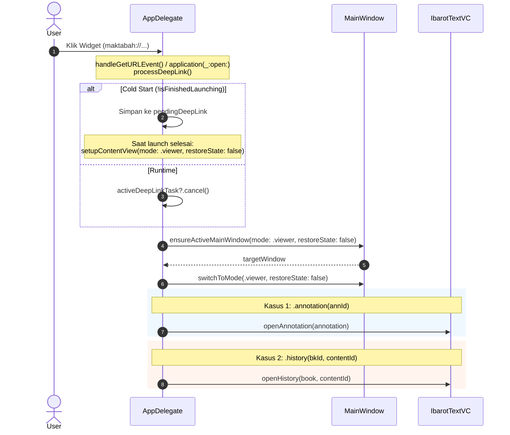

# macOS Integration

Widget Maktabah di macOS (macOS 15+) mendukung penempatan pada Desktop maupun Notification Center melalui `MaktabahWidgetBundle`. Karena antarmuka dibangun dengan SwiftUI bersama (*shared code*), integrasi macOS berpusat pada penyesuaian tipografi desktop dan orkestrasi URL deep link melalui AppKit.

---

## 1. Alur Penanganan Deep Link

Ketika pengguna mengklik kartu widget di Desktop macOS, sistem operasi mengirimkan Apple Event dengan skema URL `maktabah://`. Alur penanganan dirancang tahan terhadap *cold start* (saat aplikasi belum berjalan) maupun *runtime invocation*:



---

## 2. Penanganan Apple Event & Antrean Deep Link (`AppDelegate`)

macOS mendaftarkan *handler* Apple Event sedini mungkin pada `applicationWillFinishLaunching` guna mencegah *event* terlewat saat *cold start*:

```swift
func applicationWillFinishLaunching(_ notification: Notification) {
    NSAppleEventManager.shared().setEventHandler(
        self,
        andSelector: #selector(handleGetURLEvent(_:withReplyEvent:)),
        forEventClass: AEEventClass(kInternetEventClass),
        andEventID: AEEventID(kAEGetURL)
    )
}

private func processDeepLink(_ deepLink: WidgetDeepLink) {
    if isFinishedLaunching {
        activeDeepLinkTask?.cancel()
        activeDeepLinkTask = Task { @MainActor in
            await handleDeepLink(deepLink)
        }
    } else {
        pendingDeepLink = deepLink
    }
}
```

Ketika `handleDeepLink` dieksekusi:

```swift
@MainActor
private func handleDeepLink(_ deepLink: WidgetDeepLink) async {
    guard !Task.isCancelled else { return }
    guard let targetWindow = ensureActiveMainWindow(mode: .viewer, restoreState: false) else { return }

    guard !Task.isCancelled else { return }
    targetWindow.switchToMode(.viewer, restoreState: false)
    let ibarotVC = targetWindow.splitVC.ibarotTextVC

    guard !Task.isCancelled else { return }
    switch deepLink {
    case let .annotation(annId):
        guard let annotation = AnnotationStore.shared.loadAnnotationById(annId) else { return }
        do {
            try await ibarotVC.openAnnotation(annotation)
        } catch { ... }

    case let .history(bkId, contentId):
        guard let book = LibraryDataManager.shared.getBook([bkId]).first else { return }
        do {
            try await ibarotVC.openHistory(book: book, contentId: contentId)
        } catch { ... }
    }
}
```

1. **Pencegahan Reset State Mode Search & Narrator**: Pemanggilan `ensureActiveMainWindow(mode: .viewer, restoreState: false)` dan `switchToMode(.viewer, restoreState: false)` membuka mode pembaca tanpa mereset *state* pencarian atau perawi yang sedang aktif.
2. **Serialisasi Task & Pembatalan**: Menugaskan eksekusi ke `activeDeepLinkTask` dan membatalkan task sebelumnya jika pengguna mengklik kartu widget secara beruntun (*rapid clicking*).
3. **Pemuatan Konten Mandiri**:
   - Untuk **Anotasi**: Menjalankan `ibarotVC.openAnnotation(annotation)` yang mengoordinasikan pembukaan buku, pembatalan task restorasi usang, navigasi ke halaman terkait, dan scrolling sorotan teks.
   - Untuk **Riwayat**: Menjalankan `ibarotVC.openHistory(book:contentId:)` yang memuat buku dan melompat ke posisi halaman terakhir.

---

## 3. Siklus Hidup & Flush Data Latar Belakang

Ketika jendela aplikasi kehilangan fokus atau aplikasi masuk ke kondisi non-aktif di macOS:

```swift
func applicationDidResignActive(_ notification: Notification) {
    flushPendingWidgetUpdates(cloudKit: true)
}

private func flushPendingWidgetUpdates(cloudKit: Bool = false) {
    WidgetUpdateCoordinator.shared.flushPendingUpdatesTask(
        forceCloudKit: cloudKit
    )
}
```

Hal ini menjamin bahwa seluruh mutasi anotasi dan pembacaan terakhir langsung dikompilasi ke dalam berkas snapshot App Group sebelum sistem menidurkan proses.

---

## 4. Adaptasi Tipografi Desktop

Di macOS, ukuran kontainer widget pada Desktop memiliki kerapatan piksel dan padding yang berbeda dari iOS:
- **`WidgetCardView`**: Menggunakan percabangan `#if os(macOS)` untuk menerapkan ukuran font Arab yang sedikit lebih proporsional (`fontSize` disesuaikan 1-2pt lebih kompak).
- **`TightArabicText`**: Mengaplikasikan `lineSpacing` kustom agar teks beraksara Arab tidak terpotong (*clipping*) pada batas atas/bawah kartu widget.
