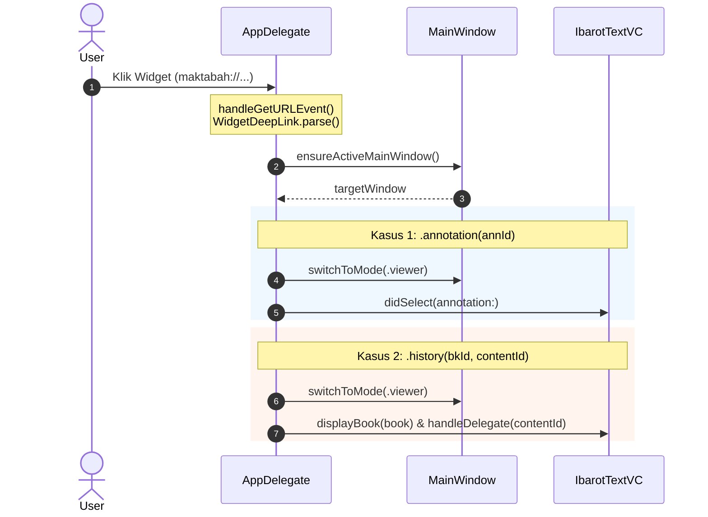

# macOS Integration

Widget Maktabah di macOS (Sonoma 14.0+) mendukung penempatan pada Desktop maupun Notification Center melalui `MaktabahWidgetBundle`. Karena antarmuka dibangun dengan SwiftUI bersama (*shared code*), integrasi macOS berpusat pada penyesuaian tipografi desktop dan orkestrasi URL deep link melalui AppKit.

---

## 1. Alur Penanganan Deep Link

Ketika pengguna mengklik kartu widget di Desktop macOS, sistem operasi mengirimkan Apple Event berprotokol `maktabah://`. Alur delegasi diproses secara modular dengan maksimal 4 partisipan:



---

## 2. Penanganan Apple Event (`AppDelegate`)

macOS menangkap pembukaan skema URL melalui `NSAppleEventManager`:

```swift
@objc func handleGetURLEvent(_ event: NSAppleEventDescriptor, withReplyEvent replyEvent: NSAppleEventDescriptor) {
    guard let urlString = event.paramDescriptor(forKeyword: AEKeyword(keyDirectObject))?.stringValue,
          let url = URL(string: urlString),
          let deepLink = WidgetDeepLink.parse(from: url),
          let targetWindow = ensureActiveMainWindow()
    else { return }

    switch deepLink {
    case let .annotation(annId):
        guard let annotation = AnnotationStore.shared.loadAnnotationById(annId) else { return }
        Task { @MainActor in
            targetWindow.switchToMode(.viewer)
            targetWindow.splitVC.ibarotTextVC.didSelect(annotation: annotation)
        }

    case let .history(bkId, contentId):
        guard let book = LibraryDataManager.shared.getBook([bkId]).first else { return }
        Task { @MainActor in
            targetWindow.switchToMode(.viewer)
            let splitVC = targetWindow.splitVC
            if splitVC.ibarotTextVC.currentBook?.id != book.id {
                try await splitVC.ibarotTextVC.displayBook(book, loadContent: contentId == nil)
            }
            if let contentId {
                splitVC.ibarotTextVC.handleDelegate(contentId)
            }
        }
    }
}
```

1. **`ensureActiveMainWindow()`**: Memverifikasi apakah jendela utama Maktabah sudah terbuka dan berstatus `keyWindow`. Jika aplikasi berjalan tanpa jendela terbuka, jendela baru diinstansiasi secara otomatis.
2. **Navigasi Mode Viewer**: Memanggil `targetWindow.switchToMode(.viewer)` untuk memastikan antarmuka berpindah dari mode Search atau Narrator menuju mode pembacaan kitab.
3. **Pemuatan Konten & Anotasi**:
   - Untuk **Anotasi**: Langsung memanggil `splitVC.ibarotTextVC.didSelect(annotation:)` yang menangani pembukaan bab terkait, pemuatan teks berharakat, dan scroll otomatis ke posisi teks tersorot.
   - Untuk **Riwayat**: Mengecek kecocokan buku aktif. Jika belum cocok, `displayBook` dipanggil secara asinkron, lalu dilanjutkan dengan `handleDelegate(contentId)` untuk lompat ke halaman tersimpan.

---

## 3. Siklus Hidup & Flush Data Latar Belakang

Ketika jendela aplikasi kehilangan fokus atau aplikasi masuk ke kondisi non-aktif di macOS:

```swift
func applicationDidResignActive(_ notification: Notification) {
    flushPendingWidgetUpdates(cloudKit: true)
}

private func flushPendingWidgetUpdates(cloudKit: Bool = false) {
    WidgetUpdateCoordinator.shared.flushPendingUpdatesTask(
        forceCloudKit: cloudKit
    )
}
```

Hal ini menjamin bahwa seluruh mutasi anotasi dan pembacaan terakhir langsung dikompilasi ke dalam berkas snapshot App Group sebelum sistem menidurkan proses.

---

## 4. Adaptasi Tipografi Desktop

Di macOS, ukuran kontainer widget pada Desktop memiliki kerapatan piksel dan padding yang berbeda dari iOS:
- **`WidgetCardView`**: Menggunakan percabangan `#if os(macOS)` untuk menerapkan ukuran font Arab yang sedikit lebih proporsional (`fontSize` disesuaikan 1-2pt lebih kompak).
- **`TightArabicText`**: Mengaplikasikan `lineSpacing` kustom agar teks beraksara Arab tidak terpotong (*clipping*) pada batas atas/bawah kartu widget.
