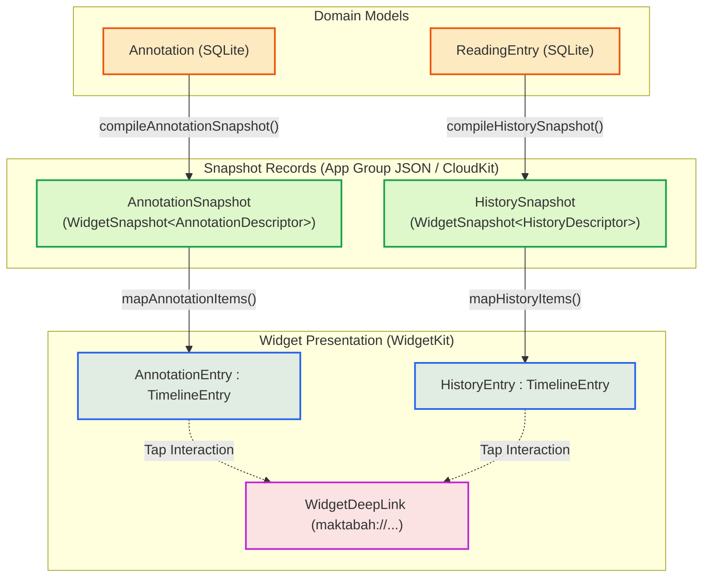

# Data Models & Snapshots

Lapisan model data pada fitur Widget dirancang secara khusus untuk pemisahan (*decoupling*) dari basis data utama SQLite Maktabah yang berukuran besar. Data yang disajikan pada widget diisolasi dalam bentuk snapshot ringan (*lightweight snapshots*) terenkapsulasi yang dapat disimpan ke format JSON dan disinkronisasikan ke CloudKit.

---

## 1. Relasi Model & Snapshot

Berikut adalah pemetaan struktural dari model domain menuju snapshot dan representasi akhir pada widget:



---

## 2. Snapshot Records

Snapshot dibangun di atas tipe generik `WidgetSnapshot<Descriptor>` yang memenuhi *protocol* `WidgetSnapshotRecord`.

### `WidgetSnapshotDescriptor` (Protocol) - Metadata Descriptor
Setiap jenis snapshot memiliki *descriptor* unik:

```swift
public protocol WidgetSnapshotDescriptor: Sendable {
    associatedtype Item: Codable, Equatable, Sendable
    static var fileName: String { get }
    static var ckRecordName: String { get }
    static var ckRecordType: String { get }
}
```

- **`AnnotationSnapshotDescriptor`**:
  - `fileName`: `"WidgetAnnotationSnapshot.json"`
  - `ckRecordName`: `"SharedAnnotationSnapshot"`
  - `ckRecordType`: `"WidgetAnnotationSnapshot"`
- **`HistorySnapshotDescriptor`**:
  - `fileName`: `"WidgetHistorySnapshot.json"`
  - `ckRecordName`: `"SharedHistorySnapshot"`
  - `ckRecordType`: `"WidgetHistorySnapshot"`

### `WidgetSnapshot` (Struct) - Snapshot Generik
```swift
public struct WidgetSnapshot<Descriptor: WidgetSnapshotDescriptor>: WidgetSnapshotRecord {
    public typealias Item = Descriptor.Item

    public var items: [Item]
    public var lastUpdated: Date
    public var generation: Int64
    public var recordChangeTag: String?
}
```

- **`generation`**: Nomor versi bertahap (*incrementing generation counter*). Setiap kali Host App menyusun snapshot baru, nilai ini dinaikkan (`currentLocal.generation + 1`). Digunakan untuk resolusi konflik deterministik terhadap data CloudKit tanpa bergantung semata pada jam lokal perangkat (*clock skew resistance*).
- **`recordChangeTag`**: Tag integritas bawaan `CKRecord` dari CloudKit untuk sinkronisasi mutasi remote.

### Item Snapshot

#### `AnnotationSnapshot.Item` (Struct)
```swift
public struct Item: Codable, Equatable, Sendable {
    public let id: String
    public let bookId: Int
    public let bookTitle: String
    public let content: String
    public let colorHex: String
    public let type: Int
    public let date: Date
}
```

#### `HistorySnapshot.Item` (Struct)
```swift
public struct Item: Codable, Equatable, Sendable {
    public let id: String
    public let bookId: Int
    public let bookTitle: String
    public let contentId: Int?
    public let date: Date?
}
```

---

## 3. Timeline Entries & Widget Items

Di dalam Widget Extension, data snapshot ditransformasikan ke dalam model tampilan yang mengadopsi *protocol* `TimelineEntry`:

- **`AnnotationEntry`**:
  ```swift
  struct AnnotationEntry: TimelineEntry {
      let date: Date
      let annotations: [AnnotationWidgetItem]
  }
  ```
  Menampung daftar item `AnnotationWidgetItem` (berisi teks konteks berharakat/polos, warna heksadesimal stabilo, tipe highlight/catatan, dan judul kitab).

- **`HistoryEntry`**:
  ```swift
  struct HistoryEntry: TimelineEntry {
      let date: Date
      let history: [HistoryItem]
  }
  ```
  Menampung daftar item `HistoryItem` (berisi judul kitab, ID konten terakhir dibaca, dan waktu akses).

---

## 4. `WidgetDeepLink` (Enum) - Deep Link Model

Ketika pengguna mengetuk salah satu kartu pada widget, interaksi diarahkan kembali ke aplikasi Maktabah melalui skema URL kustom `maktabah://`:

```swift
enum WidgetDeepLink: Equatable {
    case annotation(id: Int64)
    case history(bkId: Int, contentId: Int?)

    var url: URL { ... }
    static func parse(from url: URL) -> WidgetDeepLink? { ... }
}
```

### Format Skema URL
- **Anotasi**: `maktabah://annotation?id={annotation_id}`
  Mengarahkan langsung ke bab/halaman kitab yang bersangkutan dan menggulirkan posisi layar ke koordinat highlight.
- **Riwayat**: `maktabah://history?bkId={book_id}&contentId={content_id}`
  Membuka buku pada bab atau halaman pembacaan terakhir (`contentId`). Apabila `contentId` kosong, kitab dibuka dari halaman pertama.
