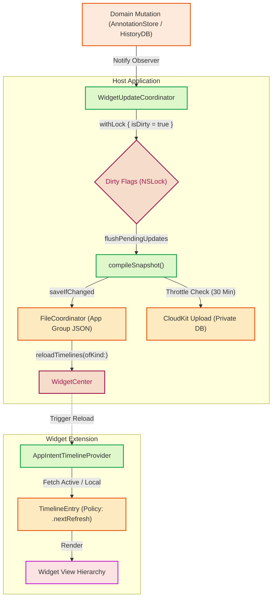

# State Management & Coordination

WidgetKit beroperasi dengan paradigma *timeline-driven* pasif yang dikendalikan oleh sistem operasi. Oleh karena itu, pada target Widget tidak digunakan *reactive ViewModel* konvensional (`@Observable` atau `ObservableObject`). Sebagai gantinya, arsitektur manajemen state dibagi menjadi dua lapisan: **`WidgetUpdateCoordinator`** di sisi Host Application dan **`TimelineProvider`** di sisi Widget Extension.

---

## 1. Arsitektur Koordinasi Pembaruan

Berikut adalah siklus aliran data dari mutasi aplikasi utama hingga rendering entri timeline pada widget:



---

## 2. WidgetUpdateCoordinator (Host App)

`WidgetUpdateCoordinator` adalah singleton berstatus `@unchecked Sendable` yang bertindak sebagai orkestrator sentral pembaruan data widget dari aplikasi utama.

### Observasi dan Thread Safety
Koordinator memantau perubahan data domain secara otomatis:
- **Anotasi**: Mendengarkan `AnnotationStore.shared.events` melalui Combine pipeline (`sink` di `DispatchQueue.main`).
- **Riwayat**: Mendengarkan notifikasi `.historyDidChange` dari `NotificationCenter`.

Status kotor (*dirty state*) disimpan dalam flag boolean privat dan dilindungi oleh `NSLock`:

```swift
private var isHistoryDirty = false
private var isAnnotationDirty = false
private let lock = NSLock()

func markHistoryDirty() {
    lock.withLock { isHistoryDirty = true }
}

func markAnnotationDirty() {
    lock.withLock { isAnnotationDirty = true }
}
```

### Flush dan Throttling CloudKit
Saat aplikasi berpindah ke latar belakang (`applicationDidResignActive`) atau sebelum terminasi, `flushPendingUpdates(forceCloudKit:)` dieksekusi secara asinkron:

1. **Atomisitas Flag**: Membaca dan mereset kedua flag dirty sekaligus di dalam blok `lock.withLock` agar tidak ada pembaruan mutasi yang hilang.
2. **Kompilasi Snapshot**: Mengompilasi 6 item terbaru dari database riwayat (`HistoryDatabaseManager`) atau anotasi (`AnnotationStore`) beserta resolusi judul kitab dari `LibraryDataManager`.
3. **Penyimpanan Lokal & Deteksi Perubahan**: Memanggil `snapshot.saveIfChanged(comparingWith:)`. Apabila ada perubahan konten, `WidgetCenter.shared.reloadTimelines(ofKind:)` langsung dipanggil untuk merefresh widget lokal.
4. **CloudKit Throttling**: Pengunggahan snapshot ke iCloud dibatasi dengan interval 30 menit (`uploadThrottleInterval = 30 * 60`) untuk menghemat kuota jaringan dan baterai, kecuali parameter `bypassThrottle` bernilai `true`.

### Dukungan Silent Push
Aplikasi mendaftarkan langganan `CKRecordZoneSubscription` dengan `shouldSendContentAvailable = true`. Ketika ada pembaruan dari perangkat lain:

1. Sistem memanggil `handleSilentPush()`.
2. Koordinator mengambil record `sharedHistorySnapshot` dan `sharedAnnotationSnapshot` secara paralel menggunakan `withTaskGroup`.
3. Memanggil `Snapshot.resolve(remote:)` untuk memeriksa versi generasi (`generation`) atau tanggal terbaru.
4. Jika payload remote lebih baru, file App Group lokal diperbarui dan timeline widget direfresh dalam batas timeout 25 detik.

---

## 3. Timeline Provider (Widget Extension)

Di dalam target Widget Extension, siklus hidup state dikelola melalui implementasi `AppIntentTimelineProvider`.

### Varian Provider
- **`AnnotationProvider`**: Mengelola widget anotasi dengan konfigurasi intent `AnnotationConfigurationIntent`.
- **`HistoryProvider`**: Mengelola widget riwayat membaca dengan intent `HistoryConfigurationIntent`.

### Metode Siklus Hidup Provider
Setiap provider mengimplementasikan 3 *protocol* esensial:

1. **`placeholder(in:)`**: Menghasilkan data dummy instan (`Kitab Al-Umm`) saat widget pertama kali ditambahkan ke galeri widget sebelum data nyata terbaca.
2. **`snapshot(for:in:)`**: Mengambil data snapshot tercepat via `Snapshot.loadLocal()` dari file JSON di App Group container untuk ditampilkan pada pratinjau galeri widget.
3. **`timeline(for:in:)`**: Memanggil `CloudKitFetcher.shared.fetchActive()` (yang memprioritaskan App Group lokal lalu remote fallback), memetakan item menjadi `TimelineEntry`, dan mengembalikan `Timeline(entries: [entry], policy: .nextRefresh)`.

### Kebijakan Refresh (`.nextRefresh`)
Kebijakan `.nextRefresh` menyerahkan kendali jadwal evaluasi ulang kepada sistem operasi berdasarkan frekuensi keterlihatan (*widget budget*), sambil tetap mengizinkan invalidasi instan secara terprogram dari Host App melalui `WidgetCenter.shared.reloadTimelines`.
