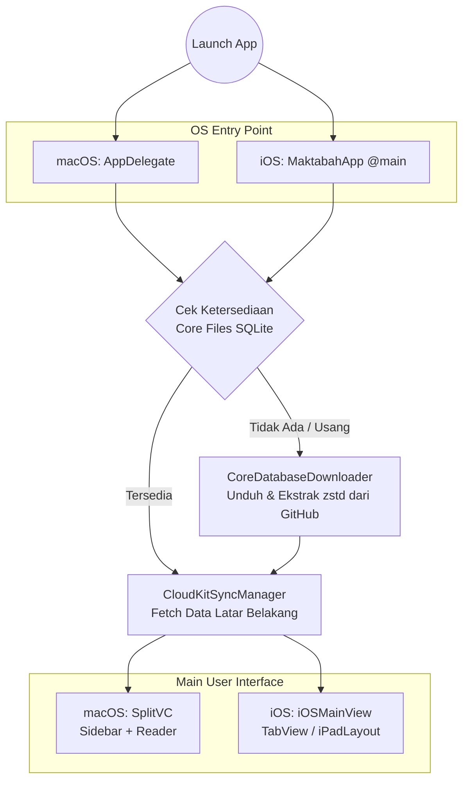

# Maktabah Technical Documentation

Dokumentasi arsitektur dan teknis internal aplikasi **Maktabah** (macOS & iOS).

---

## Gambaran Arsitektur

Maktabah menggunakan arsitektur dual-platform modular berbasis Swift:

* **Platform UI**: macOS (AppKit) & iOS (SwiftUI + UIKit bridge)
* **Penyimpanan Lokal**: SQLite (libsqlite3) terkompresi Zstandard (`zstd`)
* **Sinkronisasi**: CloudKit Custom Zone (Private Database)
* **Pencarian**: SQLite FTS5 concurrent worker pool

### Siklus Hidup Aplikasi (App Lifecycle & Entry Point)

Pipa (pipeline) inisialisasi aplikasi berjalan secara sistematis sebelum antarmuka pengguna ditampilkan:

1. **Entry Point OS**: Aplikasi diluncurkan melalui delegasi native (AppKit `AppDelegate` di Mac, atau SwiftUI `@main` di iOS).
2. **Pemeriksaan Core Database**: Sistem memvalidasi keberadaan `main.sqlite` dan `special.sqlite` pada direktori *Application Support*.
3. **Download & Ekstraksi**: Jika arsip tidak ada (pengguna baru) atau versi usang, `CoreDatabaseDownloader` akan mengambil paket `.zst` dari GitHub Releases dan mengekstraknya seketika.
4. **CloudKit Sync**: Menarik mutasi data anotasi, histori, dan markah luring (*offline pending sync*) secara asinkron agar konsisten lintas perangkat.
5. **Presentasi View**: Alur memuncak pada perenderan antarmuka utama (`SplitVC` di macOS, `iOSMainView` di iOS) yang siap merespons interaksi pengguna.

---

## Struktur Dokumentasi

### 1. Memulai & Persiapan
* [Getting Started](getting-started.md)

### 2. Core Architecture
* [App Configuration](core/configuration.md)
* [CloudKit SyncEngine](core/cloudkit.md)
* [Database Management](core/database.md)
* [Search Engine](core/search-engine.md)
* [Text Processing](core/text-processing.md)
* [UI Core (iOS)](core/ios/mainview.md)
* [UI Core (macOS)](core/macos/splitvc.md)

### 3. Feature Modules
* [Annotations](features/annotations/index.md)
* [Bookmarks](features/bookmarks/index.md)
* [Global Architecture](features/index.md)
* [History](features/history/index.md)
* [Library & Catalog](features/library/index.md)
* [Narrator (Rijal)](features/narrator/index.md)
* [Quran & Tafsir](features/quran/index.md)
* [Reader Engine](features/reader/index.md)
* [Search](features/search/index.md)
* [Widgets](features/widget/index.md)

### 4. Troubleshooting
* [Debugging & Troubleshooting Guide](troubleshooting/index.md)
